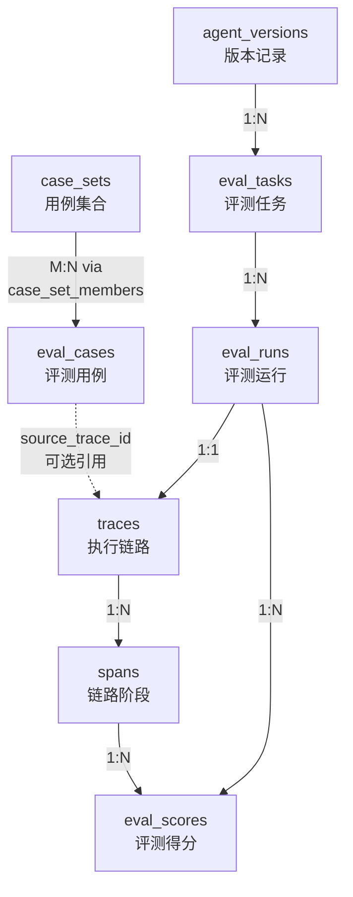
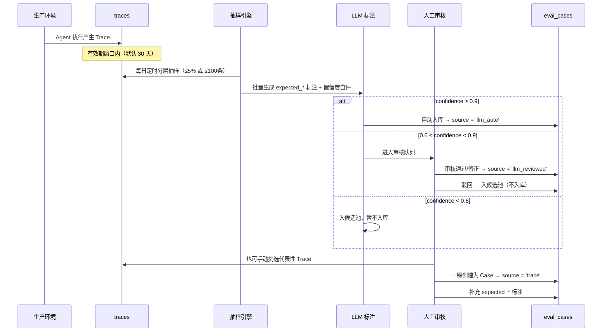
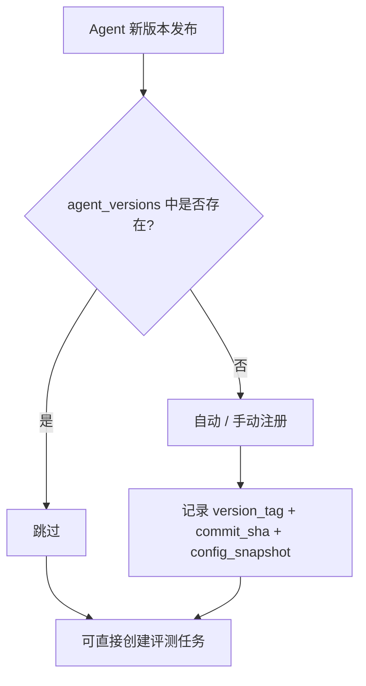

# 数据模型与存储设计

---

## 1. 实体关系



**实体说明**：

| 实体 | 含义 | 关键关系 |
|------|------|---------|
| `case_sets` | 用例集合，一组评测用例的容器 | M:N → eval_cases（通过 case_set_members 中间表） |
| `case_set_members` | 用例与集合的多对多关联表 | FK → case_sets + eval_cases |
| `eval_cases` | 评测用例，定义输入和期望输出 | 可引用 traces（source_trace_id）；source 标识标注来源（manual / trace / llm_auto / llm_reviewed / hybrid） |
| `agent_versions` | Agent 版本记录 | — |
| `eval_tasks` | 一次评测任务，从 case_set 中选 case | 1:N → eval_runs |
| `eval_runs` | 单个 case 的一次评测执行 | 1:1 → traces |
| `traces` | 一次 Agent 执行的完整链路，无论来源 | 1:N → spans |
| `spans` | Trace 中的阶段（intent/retrieval/tool_call/generation） | 1:N → eval_scores（同一 span 可被多次评测） |
| `eval_scores` | 评测器对 Span 的打分明细；Outcome 层 span_id=NULL；通过 eval_run_id 关联具体 Run | 可空 FK → spans；NOT NULL FK → traces；NOT NULL FK → eval_runs |

### SpanType → 评测层映射

评测系统通过 SpanType 定位评测层，映射关系如下：

| span_type | 评测层 (layer) | 说明 |
|-----------|---------------|------|
| `intent` | `intent` | 意图识别层，一对一映射 |
| `retrieval` | `retrieval` | 召回层，一对一映射 |
| `tool_call` | `tool` | 工具调用层，注意命名不一致：span_type 为 `tool_call`，评测层名为 `tool` |
| `generation` | `generation` | 生成层，一对一映射 |
| *(无 span)* | `outcome` | 效果层不绑定 span，span_id = NULL |

> **注意**：评测层名 `tool` 在 EvalScore 中通过 `span_id` 查 span 反推 `span_type='tool_call'` 来确定。`_span_type_to_layer()` 函数负责此双向映射。

**Trace 可以变成 Case**：通过 LLM 定时抽样 + 人工审核的复合管线，将生产 Trace 转化为长期评测用例。Case 通过 `source` 字段精确追溯标注来源（详见 [evaluation-design.md §1.4.6](evaluation-design.md#146-表结构变更标注来源追踪)）。

---

## 2. 核心 DDL

### 2.1 case_sets

```sql
CREATE TABLE case_sets (
    id          UUID PRIMARY KEY DEFAULT gen_random_uuid(),
    name        VARCHAR(255) NOT NULL UNIQUE,
    description TEXT,
    category    VARCHAR(100),                -- 测试集分类
    version     VARCHAR(50) NOT NULL DEFAULT '1.0.0',
    case_count  INTEGER NOT NULL DEFAULT 0,  -- 冗余计数，避免每次 COUNT
    tags        TEXT[] DEFAULT '{}',
    metadata    JSONB DEFAULT '{}',
    created_at  TIMESTAMPTZ NOT NULL DEFAULT now(),
    updated_at  TIMESTAMPTZ NOT NULL DEFAULT now()
);
```

### 2.2 case_set_members

用例与测试集的多对多关联表。

```sql
CREATE TABLE case_set_members (
    case_set_id UUID NOT NULL REFERENCES case_sets(id) ON DELETE CASCADE,
    case_id     UUID NOT NULL REFERENCES eval_cases(id) ON DELETE CASCADE,
    added_at    TIMESTAMPTZ DEFAULT now(),
    PRIMARY KEY (case_set_id, case_id)
);
```

### 2.3 eval_cases

```sql
CREATE TABLE eval_cases (
    id                  UUID PRIMARY KEY DEFAULT gen_random_uuid(),
    query               TEXT NOT NULL,
    context             JSONB DEFAULT '{}',

    -- 期望标注（各层评测基准）
    expected_intent     JSONB DEFAULT '{}',
    expected_retrieval  JSONB DEFAULT '{}',
    expected_tools      JSONB DEFAULT '[]',
    expected_answer     JSONB DEFAULT '{}',
    gold_answer         TEXT,

    -- 来源：标注方式与审核状态
    source              VARCHAR(20) NOT NULL DEFAULT 'manual'
                        CHECK (source IN ('manual', 'trace', 'llm_auto', 'llm_reviewed', 'hybrid')),
    source_trace_id     UUID,              -- 来源 Trace，手动创建时为 NULL
    annotation_method   JSONB DEFAULT '{}', -- 各字段标注方法明细 {"intent": "human", "tools": "llm_v2", ...}
    annotation_confidence NUMERIC(3,2),    -- LLM 标注时的整体置信度 0-1
    review_status       VARCHAR(20) NOT NULL DEFAULT 'none'
                        CHECK (review_status IN ('none', 'pending', 'approved', 'rejected')),
    sampling_batch_id   UUID,              -- LLM 定时抽样批次 ID
    reviewed_by         VARCHAR(100),      -- 审核人
    reviewed_at         TIMESTAMPTZ,       -- 审核时间

    -- Trace 快照（从生产 Trace 创建时保存，保证原 Trace 删除后 Case 仍可回放）
    metadata            JSONB DEFAULT '{}', -- {trace_id, final_response, spans_summary, snapshot_at}

    -- 健康状态（自动维护，用于标记失效 Case）
    run_count           INTEGER DEFAULT 0,  -- 累计执行次数
    last_avg_score      NUMERIC(5,2),       -- 最近 10 次平均得分
    health_status       VARCHAR(20) NOT NULL DEFAULT 'active'
                        CHECK (health_status IN ('active', 'suspected_stale', 'deprecated')),

    -- 元信息
    difficulty          VARCHAR(20) DEFAULT 'medium'
                        CHECK (difficulty IN ('easy', 'medium', 'hard')),
    category            VARCHAR(100),
    tags                TEXT[] DEFAULT '{}',
    priority            INTEGER DEFAULT 0,
    is_active           BOOLEAN NOT NULL DEFAULT true,

    created_at          TIMESTAMPTZ NOT NULL DEFAULT now(),
    updated_at          TIMESTAMPTZ NOT NULL DEFAULT now()
);

CREATE INDEX idx_eval_cases_source_trace ON eval_cases(source_trace_id);
CREATE INDEX idx_eval_cases_difficulty ON eval_cases(difficulty);
CREATE INDEX idx_eval_cases_category ON eval_cases(category);
CREATE INDEX idx_eval_cases_source ON eval_cases(source);
CREATE INDEX idx_eval_cases_review_status ON eval_cases(review_status);
CREATE INDEX idx_eval_cases_batch ON eval_cases(sampling_batch_id);
CREATE INDEX idx_eval_cases_health ON eval_cases(health_status);
```

**`source` 字段语义**：

| source 值 | 含义 | 典型场景 |
|-----------|------|---------|
| `manual` | 纯人工标注 | 测试用例设计师手动创建 |
| `trace` | 从生产 Trace 创建，人工补充标注 | Web Console 一键转 Case 后人工标注 |
| `llm_auto` | LLM 生成 + 自动入库（confidence ≥ 0.9） | 定时抽样管线自动产出 |
| `llm_reviewed` | LLM 生成 + 人工审核通过 | 审核队列中人工确认/修正后入库 |
| `hybrid` | 混合标注（部分字段 LLM，部分人工） | 意图+工具 LLM 生成，gold_answer 人工撰写 |

**`annotation_method` JSONB 结构**：

```json
{
  "intent":      {"method": "llm_v2", "confidence": 0.95},
  "retrieval":   {"method": "human",  "confidence": 1.0},
  "tools":       {"method": "llm_v2", "confidence": 0.88, "human_corrected": ["params.query"]},
  "answer":      {"method": "llm_v2", "confidence": 0.72},
  "gold_answer": {"method": "human",  "confidence": 1.0}
}
```

字段级别的 tracking 支持后续分析"LLM 标注 vs 人工标注对评测得分的影响偏差"。

### 2.4 agent_versions

```sql
CREATE TABLE agent_versions (
    id              UUID PRIMARY KEY DEFAULT gen_random_uuid(),
    version_tag     VARCHAR(100) NOT NULL UNIQUE,
    commit_sha      VARCHAR(40),
    description     TEXT,
    config_snapshot JSONB,
    deploy_time     TIMESTAMPTZ,
    created_at      TIMESTAMPTZ NOT NULL DEFAULT now()
);

CREATE INDEX idx_agent_versions_tag ON agent_versions(version_tag);
```

### 2.5 eval_tasks

```sql
CREATE TABLE eval_tasks (
    id              UUID PRIMARY KEY DEFAULT gen_random_uuid(),
    name            VARCHAR(255) NOT NULL,
    agent_version   VARCHAR(100) NOT NULL,
    case_set_id     UUID REFERENCES case_sets(id),

    status          VARCHAR(20) NOT NULL DEFAULT 'pending'
                    CHECK (status IN ('pending', 'running', 'completed', 'failed', 'cancelled')),

    total_cases     INTEGER NOT NULL DEFAULT 0,
    completed_cases INTEGER NOT NULL DEFAULT 0,
    failed_cases    INTEGER NOT NULL DEFAULT 0,

    summary_metrics JSONB,

    config          JSONB DEFAULT '{}',
    created_by      VARCHAR(100),

    created_at      TIMESTAMPTZ NOT NULL DEFAULT now(),
    started_at      TIMESTAMPTZ,
    completed_at    TIMESTAMPTZ
);

CREATE INDEX idx_eval_tasks_version ON eval_tasks(agent_version);
CREATE INDEX idx_eval_tasks_status ON eval_tasks(status);
CREATE INDEX idx_eval_tasks_created ON eval_tasks(created_at DESC);
```

### 2.6 eval_runs

```sql
CREATE TABLE eval_runs (
    id              UUID PRIMARY KEY DEFAULT gen_random_uuid(),
    task_id         UUID NOT NULL REFERENCES eval_tasks(id) ON DELETE CASCADE,
    eval_case_id    UUID NOT NULL,
    agent_version   VARCHAR(100) NOT NULL,

    status          VARCHAR(20) NOT NULL DEFAULT 'pending'
                    CHECK (status IN ('pending', 'running', 'completed', 'failed', 'timeout')),

    trace_id        UUID,           -- 关联 Trace，Agent 执行完成后写入

    -- 标注快照（创建 run 时从 eval_case 复制，防止后续标注修改导致历史评测不可复现）
    expected_snapshot JSONB,

    error_message   TEXT,
    error_type      VARCHAR(50),
    retry_count     INTEGER NOT NULL DEFAULT 0,

    created_at      TIMESTAMPTZ NOT NULL DEFAULT now(),
    started_at      TIMESTAMPTZ,
    completed_at    TIMESTAMPTZ
);

CREATE INDEX idx_eval_runs_task ON eval_runs(task_id);
CREATE INDEX idx_eval_runs_trace ON eval_runs(trace_id);
CREATE INDEX idx_eval_runs_version ON eval_runs(agent_version, created_at);
CREATE INDEX idx_eval_runs_status ON eval_runs(status);
```

### 2.7 traces

```sql
CREATE TABLE traces (
    id              UUID PRIMARY KEY DEFAULT gen_random_uuid(),
    agent_version   VARCHAR(100) NOT NULL,
    session_id      VARCHAR(100),

    -- 输入
    query           TEXT NOT NULL,
    context         JSONB DEFAULT '{}',

    -- 输出
    final_response  TEXT,
    status          VARCHAR(20) NOT NULL DEFAULT 'success'
                    CHECK (status IN ('success', 'error', 'timeout', 'partial')),

    -- 来源
    source          VARCHAR(20) NOT NULL DEFAULT 'eval'
                    CHECK (source IN ('eval', 'production')),
    source_ref       VARCHAR(255),  -- 生产环境的引用标识（如请求 ID）

    -- 性能
    total_latency_ms INTEGER,
    total_tokens    JSONB,
    total_cost_usd  NUMERIC(10,6),

    -- 得分（聚合自 Span 或评测器计算）
    overall_score   NUMERIC(5,2),

    created_at      TIMESTAMPTZ NOT NULL DEFAULT now()
);

CREATE INDEX idx_traces_version ON traces(agent_version, created_at);
CREATE INDEX idx_traces_source ON traces(source);
CREATE INDEX idx_traces_score ON traces(overall_score);
CREATE INDEX idx_traces_status ON traces(status);
```

### 2.8 spans

```sql
CREATE TABLE spans (
    id              UUID PRIMARY KEY DEFAULT gen_random_uuid(),
    trace_id        UUID NOT NULL REFERENCES traces(id) ON DELETE CASCADE,
    span_type       VARCHAR(20) NOT NULL
                    CHECK (span_type IN ('intent', 'retrieval', 'tool_call', 'generation')),
    sequence        INTEGER NOT NULL,    -- 在 Trace 中的执行顺序

    -- 输入输出
    input           JSONB,
    output          JSONB,

    -- 工具调用特有（span_type = 'tool_call' 时使用）
    tool_name       VARCHAR(100),
    tool_params     JSONB,
    tool_result     JSONB,
    tool_status     VARCHAR(20),

    -- 性能
    latency_ms      INTEGER,
    tokens          JSONB,
    model           VARCHAR(100),

    -- 得分
    score           NUMERIC(5,2),

    -- 元数据
    metadata        JSONB DEFAULT '{}',

    created_at      TIMESTAMPTZ NOT NULL DEFAULT now(),

    UNIQUE(trace_id, span_type, sequence)
);

CREATE INDEX idx_spans_trace ON spans(trace_id, sequence);
CREATE INDEX idx_spans_type ON spans(span_type);
CREATE INDEX idx_spans_score ON spans(span_type, score);
CREATE INDEX idx_spans_tool ON spans(tool_name) WHERE span_type = 'tool_call';
```

### 2.9 eval_scores

```sql
CREATE TABLE eval_scores (
    id                    UUID PRIMARY KEY DEFAULT gen_random_uuid(),
    trace_id              UUID NOT NULL REFERENCES traces(id) ON DELETE CASCADE,
    span_id               UUID REFERENCES spans(id) ON DELETE CASCADE,  -- 可空：Outcome 层不绑定 span

    score                 NUMERIC(5,2) NOT NULL CHECK (score >= 0 AND score <= 100),
    metrics               JSONB NOT NULL DEFAULT '{}',

    eval_run_id            UUID NOT NULL REFERENCES eval_runs(id) ON DELETE CASCADE,

    evaluator_version     VARCHAR(50),
    judge_trace           JSONB,         -- LLM-as-Judge 裁决过程
    evaluation_latency_ms INTEGER,
    method                VARCHAR(20) CHECK (method IN ('deterministic', 'llm_judge', 'hybrid', 'manual')),

    created_at            TIMESTAMPTZ NOT NULL DEFAULT now()
);

CREATE INDEX idx_eval_scores_trace ON eval_scores(trace_id);
CREATE INDEX idx_eval_scores_span ON eval_scores(span_id);
CREATE INDEX idx_eval_scores_run ON eval_scores(eval_run_id);
```

---

## 3. 数据关系说明

### 3.1 两条数据来源路径

```
路径 A：评测触发（source = 'eval'）
  eval_tasks → eval_runs → traces → spans → eval_scores
  每个 eval_run 产生一条 trace，Span 得分由评测器写入 eval_scores 后回填 spans.score

路径 B：生产采样（source = 'production'）
  traces → spans
  生产环境的 Agent 执行直接写入 traces + spans
  eval_cases.source = 'trace' + source_trace_id 指向被选中的 Trace
```

### 3.2 Trace 如何变成 Case

系统通过「LLM 定时抽样 + 置信度分流 + 人工兜底」的复合管线，将生产环境 Trace 转化为长期评测用例。详见 [evaluation-design.md §1.4.3](evaluation-design.md#143-来源详解)。



eval_cases 表中 query 字段从 traces.query 复制。期望标注可通过**人工标注**（source = `manual`/`trace`）、**LLM 自动标注**（source = `llm_auto`）、**LLM + 人工复合**（source = `llm_reviewed`/`hybrid`）三种方式生成。`annotation_method` JSONB 字段记录了每个字段的具体标注来源和置信度。

### 3.3 Score 的归属

| 实体 | score 字段 | 含义 | 计算方式 |
|------|-----------|------|---------|
| spans | `spans.score` | 该阶段的得分 | 由 eval_scores 计算后回填（不含 Outcome） |
| traces | `traces.overall_score` | 整条链路的综合得分 | 五层得分加权平均 |
| `eval_scores` | `eval_scores.score` | 评测器的打分输出 | 评测器计算；Outcome 层 `span_id = NULL`；通过 `eval_run_id` 关联 EvalRun 实现多轮评分独立记录 |

### 3.4 版本维护

#### 3.4.1 版本注册

Agent 版本信息通过以下方式写入 `agent_versions`：

| 方式 | 触发时机 | 典型场景 |
|------|---------|---------|
| **手动注册** | Web Console / API 手动录入 | 首次接入评测系统时 |
| **CI/CD 自动注册** | 发布流水线中调用 API | 每次 Agent 发版自动记录 |
| **评测时自动记录** | 创建 eval_task 时检测到新 version_tag | 快速试跑，无需提前注册 |



#### 3.4.2 版本字段说明

| 字段 | 来源 | 说明 |
|------|------|------|
| `version_tag` | CI 环境变量 / 手动输入 | 如 `v2.3.1`，语义化版本 |
| `commit_sha` | `git rev-parse HEAD` | 精确追溯代码 |
| `config_snapshot` | Agent 启动时导出的配置 JSON | prompt 模板、模型名、温度等，版本对比时辅助定位差异原因 |
| `deploy_time` | 部署/发布时间 | 生产环境生效时间点 |

#### 3.4.3 版本引用关系

eval_tasks 和 traces 中的 `agent_version` 字段为 `VARCHAR(100)`，通过 `version_tag` 关联 agent_versions，**不设外键约束**。理由：

- 可以先跑评测后补注册版本（评测任务引用一个 tag，事后补充 metadata）
- prod 环境的 Trace 上报时可能尚未注册版本
- 版本删除不影响历史评测数据

同理，`eval_runs` 表中的 `eval_case_id` 和 `trace_id` 也不设外键约束：
- `eval_case_id`：Case 被删除后历史 Run 仍需保留，供审计溯源
- `trace_id`：run 创建时 trace 尚未产生，需后续回填；Trace 被清理后 run 不应级联删除

查询时通过 `version_tag` JOIN：

```sql
SELECT t.*, av.commit_sha, av.config_snapshot
FROM traces t
LEFT JOIN agent_versions av ON av.version_tag = t.agent_version;
```

#### 3.4.4 版本对比基线

评测任务创建时指定 `agent_version`，版本对比时选择两个已完成的 eval_task：

```
评测任务 A (v2.3.0) ──┐
                      ├──▶ 对比引擎 ──▶ 对比报告
评测任务 B (v2.3.1) ──┘
```

**对比前置条件**（详见 [analysis-and-compare.md §2.1](analysis-and-compare.md)）：

| 条件 | 说明 |
|------|------|
| 同一 `case_set_id` | 使用相同的测试用例集合 |
| 同一 `evaluator_version` | 评测器版本一致，否则分数不可比 |
| 同一 `enabled_layers` | 参与评测的层必须一致 |
| 同一权重配置 | 各层维度权重一致 |

### 3.5 典型查询

```sql
-- 查看某个版本的意图识别平均得分
SELECT AVG(score) FROM spans WHERE span_type = 'intent'
  AND trace_id IN (SELECT id FROM traces WHERE agent_version = 'v2.3.1');

-- 查看某次评测任务的各层得分分布
SELECT s.span_type, AVG(s.score),
       PERCENTILE_CONT(0.5) WITHIN GROUP (ORDER BY s.score) AS p50
FROM spans s
JOIN traces t ON t.id = s.trace_id
JOIN eval_runs r ON r.trace_id = t.id
JOIN eval_scores es ON es.eval_run_id = r.id
WHERE r.task_id = 'xxx'
GROUP BY s.span_type;

-- 查看某个 Case 的历次评分历史（每次独立记录）
SELECT r.id AS run_id, r.created_at, es.score, es.metrics, es.method
FROM eval_runs r
JOIN eval_scores es ON es.eval_run_id = r.id
WHERE r.eval_case_id = 'case_uuid'
ORDER BY r.created_at DESC;

-- 找出从生产环境 Trace 创建的所有 Case
SELECT * FROM eval_cases WHERE source = 'trace' AND source_trace_id IS NOT NULL;

-- 查看某个 Trace 的完整链路和每层得分
SELECT span_type, sequence, score, latency_ms
FROM spans WHERE trace_id = 'xxx' ORDER BY sequence;

-- 从生产 Trace 中创建 Case（两步：先创建 Case，再关联到 Case Set）
INSERT INTO eval_cases (query, source, source_trace_id)
SELECT query, 'trace', id FROM traces WHERE id = 'trace_yyy';

INSERT INTO case_set_members (case_set_id, case_id)
VALUES ('set_xxx', '<新创建的 case_id>');
```

---

## 4. 存储选型

PostgreSQL + JSONB。理由：

- **Span 的 input/output/tool_params 用 JSONB**：不同 Span 类型的结构差异大（意图输出 ≠ 工具参数），JSONB 避免稀疏列
- **结构化字段（span_type, score, latency_ms）用普通列**：高频查询和聚合走 B-tree 索引
- **不用 MongoDB**：评测系统需要事务和 JOIN，PG 更擅长

---

## 5. 数据生命周期

| 阶段 | 时间 | 策略 |
|------|------|------|
| 热数据 | ≤ 30 天 | 全索引，SSD，Dashboard 实时数据源 |
| 温数据 | 30-90 天 | 精简索引，保留结构化字段，JSONB 字段保留 |
| 冷数据 | > 90 天 | spans.input/output 归档到 S3（Parquet），主表仅保留结构化列 |
