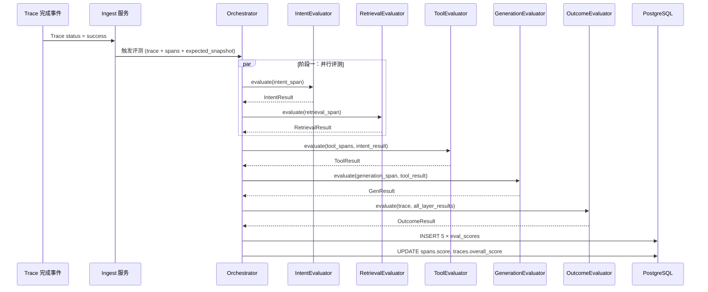
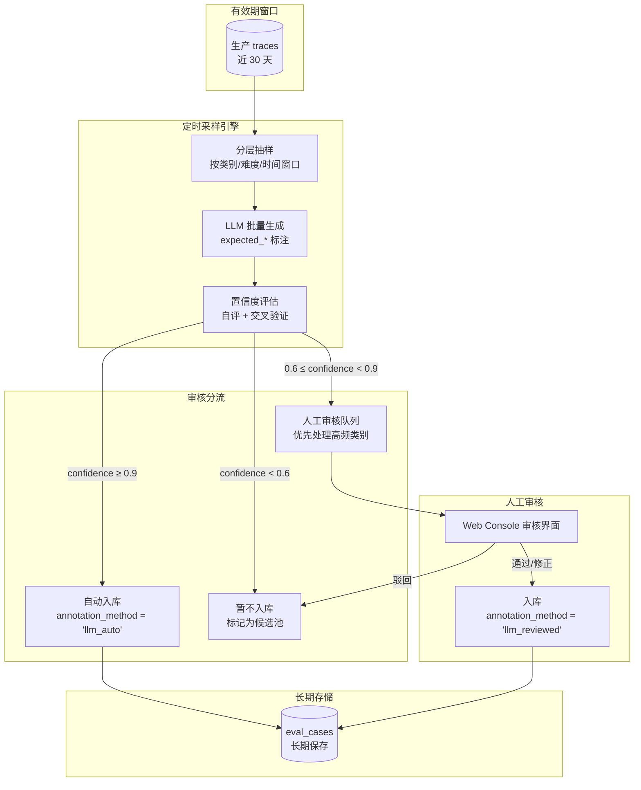
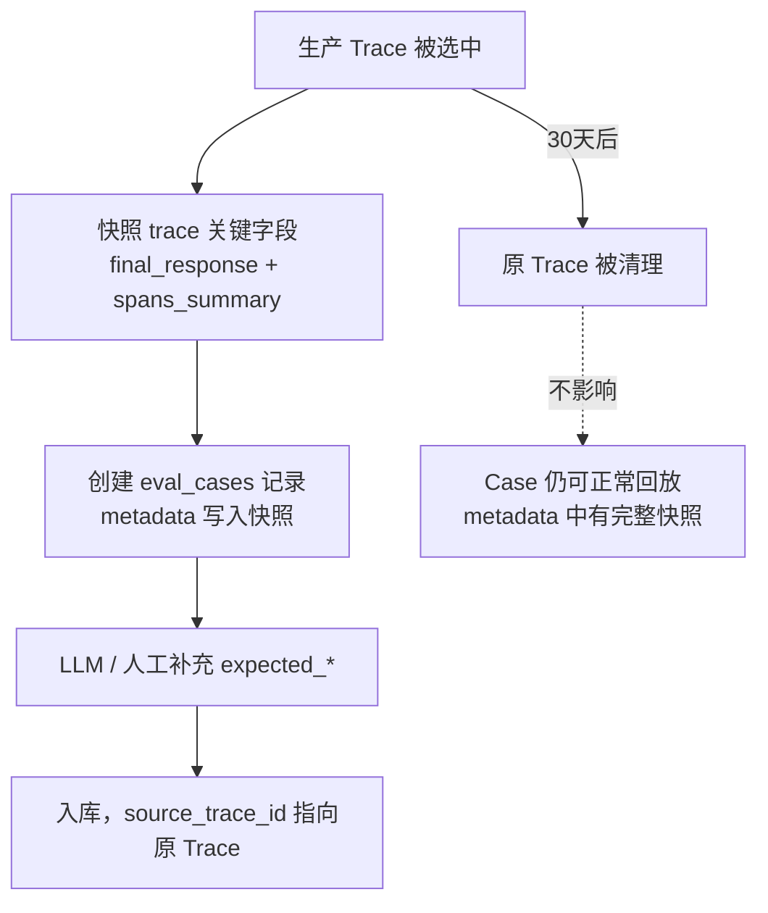
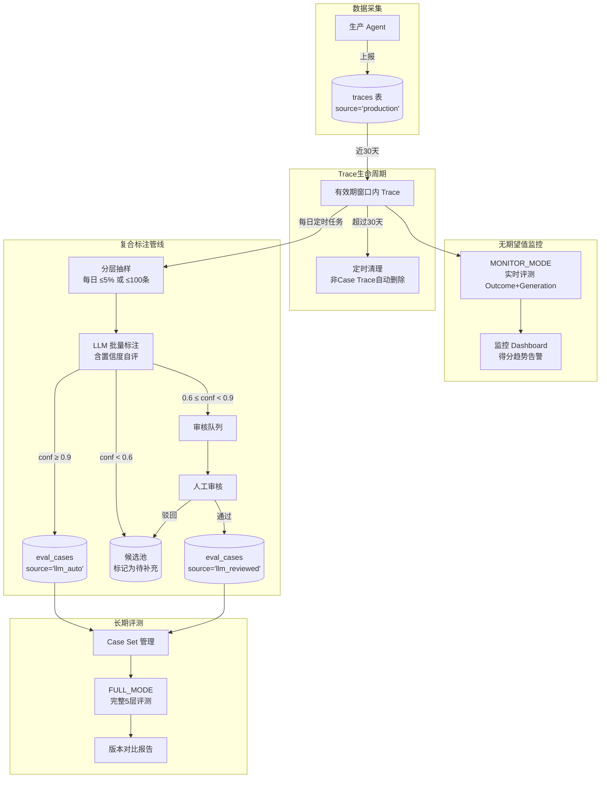

# 评测维度与方法设计

> 本文档定义评测器插件架构、五层评测详细维度、评分公式、LLM-as-Judge Prompt 模板与会话策略。

---

## 1. 评测器架构总览

### 1.1 在系统中的位置

评测器是评测执行引擎的核心组件，消费 `traces` + `spans` 数据，参照 `eval_cases` 的期望标注，输出 `eval_scores`。评测结果进一步被分析层消费，用于版本对比和报告生成。

```
                          ┌─────────────────────────┐
  被测 Agent              │     评测执行引擎          │
  (上报 Trace + Span)     │                         │
       │                  │  ┌───────────────────┐  │
       ▼                  │  │   Evaluator 工厂   │  │
  ┌──────────┐            │  │   (Registry)       │  │
  │  Traces  │───────────▶│  └────────┬──────────┘  │       ┌──────────────┐
  │  Spans   │            │           │             │       │  分析层       │
  └──────────┘            │  ┌────────▼──────────┐  │       │  版本对比     │
                          │  │  5 层评测器        │  │──────▶│  报告生成     │
       │                  │  │  Intent/Retrieval  │  │       └──────────────┘
       ▼                  │  │  Tool/Gen/Outcome  │  │
  ┌──────────┐            │  └────────┬──────────┘  │
  │eval_cases│            │           │             │
  │(期望标注) │───────────▶│  ┌────────▼──────────┐  │
  └──────────┘            │  │  eval_scores (DB)  │  │
                          │  └───────────────────┘  │
                          └─────────────────────────┘
```

### 1.2 五层评测与数据模型的对应关系

评测系统遵循 Agent 执行链路的自然分层，对五层独立度量后汇聚为端到端质量画像：

| 评测层 | 层名 | 对应 SpanType | 数据来源 | 评测目标 |
|--------|------|--------------|---------|---------|
| 意图层 | `intent` | `intent` | `spans(span_type='intent')` | 用户意图分类是否准确、完整 |
| 召回层 | `retrieval` | `retrieval` | `spans(span_type='retrieval')` | 检索结果的精度与召回质量 |
| 工具层 | `tool` | `tool_call` | `spans(span_type='tool_call')` | 工具选择、参数与调用序列正确性 |
| 生成层 | `generation` | `generation` | `spans(span_type='generation')` + `traces.final_response` | 答案的事实准确性、完整性、语言质量 |
| 效果层 | `outcome` | *(不绑定单条 span)* | `traces` + 所有 spans + 各层得分 | 端到端任务完成度与用户体验 |

**注意**：效果层不直接对应单条 span，而是对整条 Trace 的综合评估。它依赖于前四层的评测结果、延迟数据、Token 消耗等全局指标。

**span_type 的来源**（详见 [trace-protocol.md §6](trace-protocol.md)）：

| 数据路径 | span_type 来源 | 说明 |
|---------|---------------|------|
| 自研 SDK（`TRACE_MODE="sdk"`） | 代码显式传入 `report_span(span_type="intent")` | 完全控制，100% 精确 |
| OTel 适配器（`TRACE_MODE="otel"`） | 三层自动推导：`eval.span_type` 属性 → 模式匹配 → 兜底返回 `span.name` | 零侵入，支持 LangChain/LlamaIndex/OpenAI Agent SDK 等框架自动映射 |

评测引擎通过 `_group_spans_by_type()` 按 `span_type` 字段分组分发到对应层评测器，不关心 `span_type` 的具体来源。

### 1.3 评测执行时序



**执行策略**：
- **Intent + Retrieval**：并行执行，互相无依赖
- **Tool**：依赖 Intent 结果（需判断工具选择是否符合意图方向）
- **Generation**：依赖 Tool 结果（需工具返回值做事实交叉验证）
- **Outcome**：依赖以上全部四层结果，最后执行

### 1.4 期望值来源与评测模式

评测系统的核心矛盾：**生产环境的 Trace 没有预先标注的期望值**。系统通过以下多层机制解决这个问题。

#### 1.4.1 两条数据路径的期望值来源

```
路径 A：评测触发（source = 'eval'）
  ┌──────────────┐     ┌──────────────┐     ┌────────────────────┐
  │ eval_cases   │────▶│ expected_    │────▶│ 评测器执行完整 5 层  │
  │ (人工/LLM标注) │     │ snapshot     │     │ 所有维度均可评测     │
  └──────────────┘     └──────────────┘     └────────────────────┘

路径 B：生产采样（source = 'production'）
  ┌──────────────┐     ┌──────────────────────────────────────────┐
  │ traces       │────▶│ 期望值缺省 → 仅评测"无需期望值"的维度      │
  │ (无预标注)    │     │ 或 → 选中为 Case → 补标注 → 走路径 A      │
  └──────────────┘     └──────────────────────────────────────────┘
```

#### 1.4.2 期望值的四种来源

| 来源 | 适用场景 | 成本 | 准确度 | 覆盖维度 |
|------|---------|------|--------|---------|
| **① 人工标注** | 正式评测测试集、回归测试 | 高（人力） | ★★★★★ | 全部 5 层 |
| **② LLM 辅助标注** | 批量构建评测集 | 中（API 费用 + 人工抽检） | ★★★★ | 全部 5 层 |
| **③ 生产 Trace 转 Case** | 从线上挑选代表性样本 | 中（一次标注，长期复用） | ★★★★★ | 全部 5 层 |
| **④ 无期望值模式** | 生产监控、快速抽查 | 零 | ★★★ | 仅无需期望值的维度 |

#### 1.4.3 来源详解

**① 人工标注** — 标准测试用例

测试用例设计师在 `eval_cases` 中手动填写期望字段：

```json
{
  "query": "帮我查一下上周 NBA 湖人队的比赛结果",
  "expected_intent": {
    "intents": ["sports_query", "team_query"],
    "entities": [{"type": "league", "value": "NBA"}, {"type": "team", "value": "湖人"}]
  },
  "expected_retrieval": {
    "relevant_ids": ["doc_001", "doc_003", "doc_007"]
  },
  "expected_tools": [
    {"tool_name": "web_search", "params": {"query": "NBA Lakers game result"}, "order_sensitive": true},
    {"tool_name": "date_calculator", "params": {"target": "last_week"}, "order_sensitive": false}
  ],
  "expected_answer": {
    "check_points": ["对手是谁", "比分", "比赛日期"],
    "format": "text"
  },
  "gold_answer": "上周湖人队以112:105战胜凯尔特人，比赛日期为..."
}
```

**②+③ 复合管线：LLM 定时抽样 + 人工审核 → 长期 Case**（核心流程）

这是生产链路持续积累评测集的主力模式，将"被动等标注"升级为"主动采样 + 置信度分流 + 人工兜底"的产线化流程。

**全流程概览**：



**关键机制**：

1. **有效期窗口**：仅保留近 N 天（默认 30 天）的生产 Trace。超过窗口的 Trace 自动清理（仅保留已转为 Case 的记录）。Trace 的 `created_at` 作为窗口判断依据。

2. **分层抽样**：按 `difficulty` 预估 / `category` / 时间窗口均匀采样，避免样本偏向简单类别或特定时段。每日抽样配额 = `min(100, 窗口内 Trace 总量的 5%)`。

3. **LLM 标注 + 自评**：LLM 不仅生成 `expected_*`，还必须输出每个字段的 `confidence`（见下方标注输出格式）。对事实性强的字段（如 `gold_answer`），LLM 标注后额外做一次"自我反驳"（self-critique），将其正确率纳入置信度。

4. **审核分流**：`confidence ≥ 0.9` 自动入库 → `0.6~0.9` 入人工审核队列 → `< 0.6` 暂存候选池。审核队列按 `category` 频率排序（高频类别优先审），人工每日抽查不低于当日入库量的 15%。

5. **复合标注记录**：每条 Case 需要记录每个字段由谁标注（见 §1.4.6 表结构），支持后续按标注来源分析分数偏差。

**LLM 标注输出格式**（用于置信度分流）：

```json
{
  "query": "帮我查一下上周 NBA 湖人队的比赛结果",
  "expected_intent": {
    "value": {
      "intents": ["sports_query", "team_query"],
      "mode": "all",
      "entities": [{"type": "league", "value": "NBA"}, {"type": "team", "value": "湖人"}]
    },
    "confidence": 0.95
  },
  "expected_tools": {
    "value": [
      {
        "tool_name": "web_search",
        "alternatives": ["google_search", "bing_search"],
        "params": {"query": "NBA Lakers game result"},
        "required_params": ["query"],
        "order_sensitive": true
      },
      {
        "tool_name": "date_calculator",
        "alternatives": [],
        "params": {"target": "last_week"},
        "required_params": ["target"],
        "order_sensitive": false
      }
    ],
    "confidence": 0.88
  },
  "expected_answer": {
    "value": {
      "check_points": [
        {"point": "对手是谁", "weight": 1.0},
        {"point": "比分", "weight": 1.0},
        {"point": "比赛日期", "weight": 0.5}
      ],
      "format": "text"
    },
    "confidence": 0.72
  },
  "gold_answer": {
    "value": "上周湖人队以112:105战胜凯尔特人，比赛日期为...",
    "confidence": 0.65
  },
  "overall_confidence": 0.78
}
```

> **提示**：`overall_confidence` 取各字段 confidence 的加权平均（意图 0.2 / 工具 0.3 / 答案 0.3 / gold_answer 0.2）。当 `gold_answer.confidence < 0.7` 时，该 Case 的 `gold_answer` 强制走人工审核。

**⑤ Trace 快照机制**（Case 创建时自动执行）

从生产 Trace 创建 Case 时，系统自动将原 Trace 的关键信息快照到 `eval_cases.metadata`，**保证原 Trace 超过 30 天有效期被清理后，Case 仍然可以正常回放评测**。

快照内容：

```json
{
  "snapshot_at": "2026-06-09T14:30:00Z",
  "source_trace_id": "uuid-of-original-trace",
  "source_trace_status": "success",
  "final_response": "湖人队以112:105战胜凯尔特人...",
  "total_latency_ms": 3450,
  "total_tokens": {"input": 1500, "output": 450},
  "spans_summary": [
    {"span_type": "intent",      "score": 92.0, "latency_ms": 120},
    {"span_type": "retrieval",   "score": 85.0, "latency_ms": 350},
    {"span_type": "tool_call",   "score": 88.0, "latency_ms": 1800, "tool_name": "web_search"},
    {"span_type": "generation",  "score": 90.0, "latency_ms": 2800}
  ],
  "snapshot_version": "1.0"
}
```

**快照时机**：



**快照原则**：
- 仅保存评测回放所需的最小字段（`final_response` + `spans_summary`），不复制完整 Span 数据
- `source_trace_id` 仍然保留以支持溯源，但允许原 Trace 被删除后变为 `NULL`
- 快照不可修改，仅在 Case 创建时写入一次

**④ 无期望值模式**（生产监控）

当 trace 没有关联任何 expected 数据时，评测器自动降级为"无期望值模式"，仅计算不依赖 ground truth 的维度。

#### 1.4.4 各维度对期望值的依赖分析

| 维度 | 需要期望值？ | 无期望值时的策略 |
|------|------------|----------------|
| **意图层** | | |
| IntentAccuracy | ✅ 需要 expected_intent | 跳过，返回 `score=null` |
| IntentCompleteness | ✅ 需要 expected_intent | 跳过 |
| ConfidenceCalibration | ❌ 不需要 | 正常计算（检查置信度合理性） |
| NERAccuracy | ✅ 需要 expected entities | 跳过 |
| **召回层** | | |
| Precision@K | ✅ 需要 relevant_ids | 跳过，返回 `score=null` |
| Recall@K | ✅ 需要 relevant_ids | 跳过 |
| MRR | ✅ 需要 relevant_ids | 跳过 |
| NDCG | ✅ 需要 relevant_ids | 跳过 |
| Diversity | ❌ 不需要 | 正常计算（基于 embedding 两两相似度） |
| **工具层** | | |
| ToolSelection | ✅ 需要 expected_tools | 跳过 |
| ParamAccuracy | ✅ 需要 expected_tools | 跳过 |
| SequenceCorrectness | ✅ 需要 expected_tools | 跳过 |
| Efficiency | ❌ 不需要 | 正常计算（仅统计调用数量、无冗余判断） |
| SuccessRate | ❌ 不需要 | 正常计算（tool_status 直接可得） |
| **生成层** | | |
| FactualAccuracy | ⚠️ 最好有 gold_answer | LLM 基于自身知识判断（准确度降低约 15-20%） |
| Completeness | ⚠️ 最好有 check_points | LLM 基于 query 自行推断应覆盖的点 |
| LanguageQuality | ❌ 不需要 | 正常计算（纯统计指标） |
| FormatCompliance | ❌ 不需要 | 正常计算（规则检查） |
| HallucinationScore | ⚠️ 最好有 reference | LLM 基于自身知识判断（对近期事实可能不准） |
| SemanticSimilarity | ✅ 需要 gold_answer | 跳过 |
| **效果层** | | |
| TaskCompletion | ❌ 不需要 | LLM 基于 query + final_response 综合判断 |
| SatisfactionEstimate | ❌ 不需要 | 基于 TaskCompletion + 体验因子 |
| LatencyScore | ❌ 不需要 | 正常计算（纯数值映射） |
| TokenEfficiency | ❌ 不需要 | 正常计算（纯数值计算） |
| ErrorRecovery | ❌ 不需要 | 正常计算（检查 tool_status 序列） |

**结论**：无期望值模式下，**效果层几乎全维度可用**，**生成层大部分维度可用**（LLM 降级判断），**召回层和意图层基本不可用**。生产监控应重点关注 Outcome + Generation 层的得分趋势。

#### 1.4.5 评测模式切换

```python
class EvaluationOrchestrator:
    """
    自动感知评测模式：
      - FULL_MODE：有关联 expected_snapshot → 全部 5 层正常评测
      - MONITOR_MODE：无 expected_snapshot → 跳过需标注的维度，仅输出可用维度
    """

    def run(self, trace: Dict, expected_snapshot: Optional[Dict] = None) -> Dict[str, EvalResult]:
        mode = "FULL" if expected_snapshot else "MONITOR"
        # 无期望值时传入空 dict，各评测器内部通过 _evaluate_dimensions 自行降级
        expected = expected_snapshot or {}
        # ... 后续流程不变，评测器内部按维度依赖自行跳过
```

**MONITOR 模式下的加权总分**：仅对可用的维度按原有权重重新归一化，缺失维度不参与计算。`eval_scores` 表中 `method` 字段记录为 `"deterministic"` 或 `"llm_judge"`，缺失的维度在 `metrics` 中标记 `"skipped": true`。

#### 1.4.6 表结构变更：标注来源追踪

为支撑复合标注管线，`eval_cases` 表需要增加以下字段：

```sql
-- 在已有 eval_cases 表基础上追加字段
ALTER TABLE eval_cases
    -- 来源细化（替换原 source 的单一值）
    ADD COLUMN source VARCHAR(20) NOT NULL DEFAULT 'manual'
        CHECK (source IN ('manual', 'trace', 'llm_auto', 'llm_reviewed', 'hybrid')),
    -- 各字段标注方法明细（JSONB）
    ADD COLUMN annotation_method JSONB DEFAULT '{}',
    -- 审核状态
    ADD COLUMN review_status VARCHAR(20) NOT NULL DEFAULT 'none'
        CHECK (review_status IN ('none', 'pending', 'approved', 'rejected')),
    -- 抽样批次 ID
    ADD COLUMN sampling_batch_id UUID,
    -- 标注置信度（LLM 生成时填写）
    ADD COLUMN annotation_confidence NUMERIC(3,2),
    -- 审核人 + 审核时间
    ADD COLUMN reviewed_by VARCHAR(100),
    ADD COLUMN reviewed_at TIMESTAMPTZ;

CREATE INDEX idx_eval_cases_source ON eval_cases(source);
CREATE INDEX idx_eval_cases_review_status ON eval_cases(review_status);
CREATE INDEX idx_eval_cases_batch ON eval_cases(sampling_batch_id);
```

**`source` 字段语义**：

| source 值 | 含义 | annotation_method 示例 |
|-----------|------|----------------------|
| `manual` | 纯人工标注 | `{"intent": "human", "tools": "human", "answer": "human"}` |
| `trace` | 从生产 Trace 创建，人工补标注 | `{"intent": "human", "tools": "human"}` |
| `llm_auto` | LLM 生成 + 自动入库（confidence ≥ 0.9） | `{"intent": "llm_v2", "tools": "llm_v2", "answer": "llm_v2"}` |
| `llm_reviewed` | LLM 生成 + 人工审核通过 | `{"intent": "llm_v2", "tools": "llm_v2_human_fix", "answer": "human"}` |
| `hybrid` | 混合标注（部分字段 LLM，部分人工） | `{"intent": "llm_v2", "tools": "human", "answer": "human"}` |

**`annotation_method` JSONB 结构**：

```json
{
  "intent":     {"method": "llm_v2", "confidence": 0.95},
  "retrieval":  {"method": "human", "confidence": 1.0},
  "tools":      {"method": "llm_v2", "confidence": 0.88, "human_corrected": ["params.query"]},
  "answer":     {"method": "llm_v2", "confidence": 0.72},
  "gold_answer":{"method": "human", "confidence": 1.0}
}
```

字段级别的 tracking 允许后续分析"LLM 标注的意图 vs 人工标注的意图，对最终得分的影响偏差"。

#### 1.4.7 期望值的灵活管理（多选/单选/发散）

期望值不是"一个萝卜一个坑"，而是需要表达多种匹配模式。

**期望值模式定义**：

```json
{
  "expected_intent": {
    "intents": ["sports_query", "team_query"],
    "mode": "all",                  // "any" | "all" | "at_least_n" | "fuzzy"
    "mode_n": null,                 // mode = "at_least_n" 时需要 >= n 个匹配
    "entities": [
      {"type": "league", "value": "NBA", "match": "exact"},
      {"type": "team", "value": "湖人", "match": "fuzzy"}
    ]
  },

  "expected_tools": [
    {
      "tool_name": "web_search",
      "alternatives": ["google_search", "bing_search"],
      "match_mode": "exact_or_alternative",  // "exact" | "exact_or_alternative" | "any_in_category"
      "params": {"query": "NBA Lakers game result"},
      "required_params": ["query"],
      "optional_params": ["max_results", "language"],
      "order_sensitive": true
    }
  ],

  "expected_answer": {
    "check_points": [
      {"point": "对手是谁", "weight": 1.0, "match": "must_contain"},
      {"point": "比分",     "weight": 1.0, "match": "must_contain"},
      {"point": "比赛日期",  "weight": 0.5, "match": "prefer_contain"},
      {"point": "球员数据",  "weight": 0.3, "match": "nice_to_have"}
    ],
    "divergent_ok": false,            // 发散型问题？true 时不强制检查 check_points
    "forbidden_patterns": ["我无法回答", "请稍后再试"]
  }
}
```

**模式详解**：

| 字段 | 模式 | 语义 | 公式行为 |
|------|------|------|---------|
| `intents.mode` | `all` | 预测意图必须覆盖全部期望意图 | Completeness 严格 = 交集 / 期望 |
| | `any` | 命中任意一个即满分 | Accuracy = 100 if 任一匹配 else 0 |
| | `at_least_n` | 至少命中 n 个 | Accuracy = min(1, 命中数 / n) × 100 |
| | `fuzzy` | 允许语义等价匹配 | 语义匹配权重从 0.7 提到 0.9 |
| `tools[].match_mode` | `exact` | 工具名必须精确匹配 | 分值为 1.0 或 0 |
| | `exact_or_alternative` | 精确匹配或命中 alternatives 列表 | 精确=1.0，alternative=0.8，都不中=0 |
| | `any_in_category` | 属于同一工具类别即可（如"任一搜索引擎"） | LLM 判断类别归属，匹配=1.0，否则=0 |
| `check_points[].match` | `must_contain` | 必须覆盖，缺失严重扣分 | 未覆盖=0，覆盖=该点权重 |
| | `prefer_contain` | 最好覆盖，未覆盖轻微扣分 | 未覆盖=该点权重×0.5 |
| | `nice_to_have` | 加分项，未覆盖不扣分 | 未覆盖=不扣分（该点仅做加分） |
| `divergent_ok` | `true` | 发散型问题（如"你觉得怎么样"），不设固定检查点 | 跳过 Completeness 维度，权重重新归一化 |

**发散型问题示例**：

```json
{
  "query": "推荐几个周末适合去的地方",
  "expected_answer": {
    "divergent_ok": true,
    "check_points": [],                // 不设检查点
    "minimal_requirements": [          // 仅检查最低要求
      "至少给出 2 个地点",
      "每个地点有简单理由"
    ],
    "forbidden_patterns": ["我不知道"]
  }
}
```

发散型问题下，Completeness 维度不再通过 check_points 评估，而是由 LLM Judge 基于 `minimal_requirements` 做宽松评判。

#### 1.4.8 全流程整合：从生产 Trace 到长期 Case



#### 1.4.9 方案查漏补缺

除上述三个问题外，以下风险点和边界情况需要在实现阶段重点关注：

| # | 缺口 / 风险 | 影响 | 建议方案 |
|---|------------|------|---------|
| 1 | **标注一致性**：LLM 与人工标注可能存在系统性差异（如 LLM 偏向给高分） | 版本对比引入系统性偏差 | 定期计算 LLM vs 人工标注的 Cohen's Kappa，差异 >0.2 时触发校准流程 |
| 2 | **Case 去重**：相似 query 可能被多次抽样转为 Case | 评测集膨胀、计算浪费 | 入库前对 query 做 embedding → 余弦相似度 → 相似度 >0.95 视为重复，合并或跳过 |
| 3 | **Case 失效检测**：Agent 知识库变更后，旧的 `gold_answer` 可能不再准确 | 评测基准自身错误 | 版本对比时，如果某 Case 在新旧版本上的分数都异常低（< 20），标记为 `suspected_stale` |
| 4 | **发散型问题的评分可比性**：发散型没有固定标准答案 | 分数波动大，难以跨版本对比 | 发散型 Case 单独标记 `evaluation_mode = 'open_ended'`，对比时单独分组，不做严格回归判断 |
| 5 | **审核队列积压**：LLM 生成速度 >> 人工审核速度 | 队列无限增长 | 设置队列容量上限（如 500 条），超限时提高自动入库阈值到 0.95，或降低抽样配额 |
| 6 | **标注版本与评测器版本耦合**：expected 字段结构变更后，旧 Case 可能不兼容新评测器 | 升级评测器后大量 Case 失效 | expected 字段定义 schema version，评测器支持向后兼容 1 个 MAJOR 版本；提供 Case 批量升级迁移工具 |

---

## 2. 评测器工厂设计

### 2.1 目录结构

```
backend/evaluators/
├── __init__.py
├── base.py           # BaseEvaluator 抽象基类 + EvalResult 数据结构
├── registry.py       # EvaluatorRegistry 注册中心工厂
├── intent.py         # 意图层评测器
├── retrieval.py      # 召回层评测器
├── tool.py           # 工具层评测器
├── generation.py     # 生成层评测器
├── outcome.py        # 效果层评测器
└── prompts/          # LLM-as-Judge Prompt 模板
    ├── intent/
    ├── tool/
    ├── generation/
    └── outcome/
```

### 2.2 抽象基类设计

```python
# backend/evaluators/base.py

from abc import ABC, abstractmethod
from dataclasses import dataclass, field
from typing import Dict, List, Optional, Any
from enum import Enum
import time


class EvalMethod(str, Enum):
    """评测方法类型"""
    DETERMINISTIC = "deterministic"   # 纯规则/统计计算
    LLM_JUDGE     = "llm_judge"       # 纯 LLM 评判
    HYBRID        = "hybrid"          # 规则 + LLM 混合
    MANUAL        = "manual"          # 人工评测


@dataclass
class EvalResult:
    """单层评测结果"""
    layer: str
    total_score: float                          # 综合得分 0-100
    metrics: Dict[str, Any]                     # 各维度详细得分
    judge_trace: Optional[Dict] = None          # LLM-as-Judge 裁决过程
    method: EvalMethod = EvalMethod.HYBRID      # 使用的评测方法
    latency_ms: float = 0.0                     # 评测耗时
    evaluator_version: str = ""                 # 评测器版本号
    error: Optional[str] = None                 # 评测失败时的错误信息

    def to_dict(self) -> Dict:
        return {
            "layer": self.layer,
            "total_score": self.total_score,
            "metrics": self.metrics,
            "judge_trace": self.judge_trace,
            "method": self.method.value,
            "latency_ms": self.latency_ms,
            "evaluator_version": self.evaluator_version,
            "error": self.error,
        }


class BaseEvaluator(ABC):
    """
    评测器抽象基类。

    子类必须实现：
      - layer_name    : 返回层名标识
      - _default_weights() : 返回各维度默认权重
      - _evaluate_dimensions() : 核心评测逻辑

    生命周期：
      1. 工厂创建实例 → 2. evaluate() 调用 → 3. 返回 EvalResult
    """

    def __init__(self, config: Optional[Dict] = None):
        self.config = config or {}
        self._weights = self._default_weights()
        if "weights" in self.config:
            # 允许通过 config 覆盖默认权重
            self._weights.update(self.config["weights"])

    # ---- 子类必须实现 ----

    @property
    @abstractmethod
    def layer_name(self) -> str:
        """返回层名，如 'intent'、'retrieval'"""
        ...

    @property
    def version(self) -> str:
        """评测器版本号，遵循 semver。子类可覆盖"""
        return "1.0.0"

    @property
    def supported_methods(self) -> List[EvalMethod]:
        """返回支持的评测方法列表"""
        return [EvalMethod.DETERMINISTIC]

    @abstractmethod
    def _default_weights(self) -> Dict[str, float]:
        """返回各维度的默认权重，权重之和应为 1.0"""
        ...

    @abstractmethod
    def _evaluate_dimensions(
        self, span: Dict, expected: Dict, **context
    ) -> Dict[str, Any]:
        """
        核心评测逻辑：计算各维度得分。

        Args:
            span: spans 表中的单条记录（dict 格式），包含 input/output 等字段
            expected: eval_cases 中该层对应的期望标注快照
            context: 上下文信息（如其他层评测结果、trace 总览数据）

        Returns:
            {"DimensionName": {"score": 85.0, "detail": {...}}, ...}
        """
        ...

    # ---- 公共接口 ----

    def evaluate(
        self, span: Dict, expected: Dict, **context
    ) -> EvalResult:
        """
        执行评测。内置计时、异常捕获、权重加权计算。

        Returns:
            EvalResult: 该层评测结果，包含总分和各维度明细。
        """
        start = time.perf_counter()
        try:
            dims = self._evaluate_dimensions(span, expected, **context)
            total = self._weighted_score(dims)
            return EvalResult(
                layer=self.layer_name,
                total_score=round(total, 2),
                metrics=dims,
                method=self._infer_method(),
                latency_ms=round((time.perf_counter() - start) * 1000, 2),
                evaluator_version=self.version,
            )
        except Exception as e:
            return EvalResult(
                layer=self.layer_name,
                total_score=0.0,
                metrics={},
                latency_ms=round((time.perf_counter() - start) * 1000, 2),
                evaluator_version=self.version,
                error=str(e),
            )

    def get_weights(self) -> Dict[str, float]:
        """获取当前权重配置"""
        return dict(self._weights)

    def set_weight(self, dim: str, value: float):
        """动态调整某维度的权重"""
        self._weights[dim] = value

    # ---- 内部方法 ----

    def _weighted_score(self, dimensions: Dict[str, Any]) -> float:
        """根据权重计算加权总分，归一化到 0-100"""
        total = 0.0
        weight_sum = 0.0
        for dim_name, weight in self._weights.items():
            if dim_name in dimensions:
                dim_val = dimensions[dim_name]
                dim_score = dim_val.get("score", 0.0) if isinstance(dim_val, dict) else float(dim_val)
                total += dim_score * weight
                weight_sum += weight
        if weight_sum > 0:
            total = total / weight_sum  # 归一化（防止权重和不是精确 1.0）
        return min(max(total, 0.0), 100.0)

    def _infer_method(self) -> EvalMethod:
        """推断本次评测实际使用的方法类型"""
        methods = self.supported_methods
        has_llm = EvalMethod.LLM_JUDGE in methods
        has_det = EvalMethod.DETERMINISTIC in methods
        if has_llm and has_det:
            return EvalMethod.HYBRID
        elif has_llm:
            return EvalMethod.LLM_JUDGE
        return EvalMethod.DETERMINISTIC
```

### 2.3 工厂模式 / 注册中心

```python
# backend/evaluators/registry.py

from typing import Dict, Type, Optional, List
from backend.evaluators.base import BaseEvaluator


class EvaluatorRegistry:
    """
    评测器注册中心 + 工厂。

    特性：
      - 同一层支持注册多个版本（实验版本与稳定版本共存）
      - 通过 set_default_version() 切换默认评测器
      - 新版本评测器发布后可无感切换

    用法示例：
        registry = EvaluatorRegistry()
        registry.register("intent", IntentEvaluator, version="1.2.0")
        evaluator = registry.create("intent", config={"weights": {...}})
    """

    def __init__(self):
        self._registry: Dict[str, Dict] = {}
        # 结构: {layer: {"default": cls, "versions": {"1.0.0": cls, ...}}}

    def register(
        self,
        layer: str,
        evaluator_cls: Type[BaseEvaluator],
        version: str = "1.0.0",
        set_default: bool = True,
    ):
        """注册一个评测器版本"""
        if layer not in self._registry:
            self._registry[layer] = {"default": None, "versions": {}}
        self._registry[layer]["versions"][version] = evaluator_cls
        if set_default:
            self._registry[layer]["default"] = evaluator_cls

    def set_default_version(self, layer: str, version: str):
        """将指定版本设为该层的默认评测器"""
        if layer not in self._registry:
            raise ValueError(f"No evaluator registered for layer '{layer}'")
        if version not in self._registry[layer]["versions"]:
            available = list(self._registry[layer]["versions"].keys())
            raise ValueError(
                f"Version '{version}' not found for layer '{layer}'. Available: {available}"
            )
        self._registry[layer]["default"] = self._registry[layer]["versions"][version]

    def create(
        self,
        layer: str,
        version: Optional[str] = None,
        config: Optional[Dict] = None,
    ) -> BaseEvaluator:
        """
        工厂方法：创建评测器实例。

        Args:
            layer: 层名（'intent' | 'retrieval' | 'tool' | 'generation' | 'outcome'）
            version: 指定版本，为 None 时使用默认版本
            config: 评测器配置（权重覆盖、LLM 参数等）
        """
        if layer not in self._registry:
            raise ValueError(f"No evaluator registered for layer '{layer}'")

        layer_registry = self._registry[layer]
        if version:
            if version not in layer_registry["versions"]:
                available = list(layer_registry["versions"].keys())
                raise ValueError(
                    f"Version '{version}' not found. Available: {available}"
                )
            cls = layer_registry["versions"][version]
        else:
            cls = layer_registry["default"]

        if cls is None:
            raise ValueError(f"No default evaluator set for layer '{layer}'")
        return cls(config=config)

    def list_layers(self) -> List[str]:
        return list(self._registry.keys())

    def list_versions(self, layer: str) -> List[str]:
        if layer in self._registry:
            return list(self._registry[layer]["versions"].keys())
        return []


# 全局单例，评测引擎通过此实例获取评测器
evaluator_registry = EvaluatorRegistry()
```

### 2.4 评测器版本管理策略

评测器自身的升级会导致同一 Trace 得分变化，因此必须做好版本管理，保证版本对比的公平性。

```
版本号规则（SemVer）：MAJOR.MINOR.PATCH

┌──────────────────────────────────────────────────────────────────┐
│ 场景 A：修复 Bug（公式错误、边界条件处理）                         │
│   → bump PATCH（1.0.0 → 1.0.1）                                 │
│   → 自动设为默认版本                                              │
│   → 历史评测数据不可比，版本对比时强制 evaluator_version 一致       │
├──────────────────────────────────────────────────────────────────┤
│ 场景 B：新增评测维度                                               │
│   → bump MINOR（1.0.0 → 1.1.0）                                  │
│   → 保留旧版本，默认切换到新版                                     │
│   → 提供「重评」功能，允许用新版评测器对历史 Trace 重新打分          │
├──────────────────────────────────────────────────────────────────┤
│ 场景 C：评分框架重构（维度体系、权重体系大改）                       │
│   → bump MAJOR（1.x → 2.0.0）                                    │
│   → 旧版和新版并行运行过渡期                                       │
│   → 提供新旧得分映射表，粗略对齐两个版本的分数区间                   │
└──────────────────────────────────────────────────────────────────┘
```

**版本记录**：每次评测的 `eval_scores.evaluator_version` 记录评测器版本号，对比时强制要求同一版本。

---

## 3. 五层评测维度与评分公式

### 3.1 意图层 (Intent Layer)

#### 3.1.1 维度定义

| 维度 | 含义 | 计算方式 | 默认权重 |
|------|------|---------|---------|
| `IntentAccuracy` | 意图分类是否正确 | 精确标签匹配 + 语义近似匹配（LLM 辅助） | 0.35 |
| `IntentCompleteness` | 是否遗漏了重要意图 | 期望意图的召回比例 | 0.25 |
| `ConfidenceCalibration` | 置信度与实际准确率是否一致 | Expected Calibration Error (ECE)，单样本用置信度合理性检查 | 0.20 |
| `NERAccuracy` | 命名实体识别准确率 | 对 (type, value) 的 F1-score | 0.20 |

#### 3.1.2 核心计算伪代码

```python
class IntentEvaluator(BaseEvaluator):

    @property
    def layer_name(self) -> str:
        return "intent"

    @property
    def supported_methods(self):
        return [EvalMethod.DETERMINISTIC, EvalMethod.LLM_JUDGE]

    def _default_weights(self):
        return {
            "IntentAccuracy": 0.35,
            "IntentCompleteness": 0.25,
            "ConfidenceCalibration": 0.20,
            "NERAccuracy": 0.20,
        }

    def _evaluate_dimensions(self, span, expected, **context):
        predicted = span.get("output", {})
        exp_intent = expected.get("expected_intent", {})

        return {
            "IntentAccuracy": self._calc_accuracy(predicted, exp_intent),
            "IntentCompleteness": self._calc_completeness(predicted, exp_intent),
            "ConfidenceCalibration": self._calc_calibration(predicted),
            "NERAccuracy": self._calc_ner(predicted, exp_intent),
        }
```

**IntentAccuracy 计算**：

```
pred_intents = predicted["intents"]   # 模型输出的意图标签列表
exp_intents  = expected["intents"]    # 期望标注的意图标签列表

exact = sum(1 for ei in exp_intents if ei in pred_intents)
fuzzy = sum(1 for ei in exp_intents if semantic_match(ei, pred_intents))

Accuracy = (exact + 0.7 × fuzzy) / len(exp_intents) × 100
```

- 精确匹配：`predicted.intent == expected.intent` → 满分
- 语义近似匹配：通过 LLM 判断两者是否等价（如 `"sports_query"` ≈ `"sports_search"`）→ 70% 分数
- 完全不匹配 → 0 分

**IntentCompleteness 计算**：

```
Completeness = |pred_intents ∩ exp_intents| / |exp_intents| × 100
```

**ConfidenceCalibration 计算**（占位逻辑，完整 ECE 需跨样本批计算）：

```
confidence = predicted["confidence"]
# 单样本占位：confidence ∈ [0, 1] 则合理
score = 100 if 0 <= confidence <= 1 else 0
```

**NERAccuracy 计算**：

```
pred_entities = {(e.type, e.value) for e in predicted["entities"]}
exp_entities  = {(e.type, e.value) for e in expected["entities"]}

tp = |pred_entities ∩ exp_entities|
precision = tp / |pred_entities|  (|pred_entities| > 0 时)
recall    = tp / |exp_entities|   (|exp_entities|  > 0 时)
F1        = 2 × precision × recall / (precision + recall)
score     = F1 × 100
```

#### 3.1.3 总分公式

```
IntentScore = 0.35 × IntentAccuracy + 0.25 × IntentCompleteness
            + 0.20 × ConfidenceCalibration + 0.20 × NERAccuracy
```

#### 3.1.4 权重调整建议

| 场景 | 调整方向 |
|------|---------|
| 意图类别多（>50 类），重点防止遗漏 | 提高 IntentCompleteness → 0.30，降低 NERAccuracy → 0.15 |
| NER 为核心功能（客服系统、订单识别） | 提高 NERAccuracy → 0.30，降低 ConfidenceCalibration → 0.10 |
| 风控场景，置信度可信度要求高 | 提高 ConfidenceCalibration → 0.30 |

---

### 3.2 召回层 (Retrieval Layer)

#### 3.2.1 维度定义

| 维度 | 含义 | 计算方式 | 默认权重 |
|------|------|---------|---------|
| `PrecisionAtK` | 返回结果中相关项占比 | TP / K | 0.25 |
| `RecallAtK` | 相关项被召回的比例 | TP / \|Relevant\| | 0.25 |
| `MRR` | 第一个相关结果的排名倒数 | 1 / rank_of_first_relevant | 0.20 |
| `NDCG` | 归一化折损累积增益 | DCG / IDCG | 0.20 |
| `Diversity` | 召回结果多样性 | 1 - avg_pairwise_cosine_similarity | 0.10 |

#### 3.2.2 核心计算伪代码

> 召回层全部使用确定性指标计算，**不接入 LLM**。

```python
import math
import numpy as np

class RetrievalEvaluator(BaseEvaluator):

    @property
    def layer_name(self) -> str:
        return "retrieval"

    @property
    def supported_methods(self):
        return [EvalMethod.DETERMINISTIC]   # 全确定性计算，不需要 LLM

    def _default_weights(self):
        return {
            "PrecisionAtK": 0.25,
            "RecallAtK": 0.25,
            "MRR": 0.20,
            "NDCG": 0.20,
            "Diversity": 0.10,
        }
```

**Precision@K & Recall@K**：

```
results      = span.output.results[:K]
result_ids   = [r.id for r in results]
relevant_ids = expected.relevant_ids

TP = |result_ids ∩ relevant_ids|

Precision@K = TP / K × 100
Recall@K    = TP / |relevant_ids| × 100
```

**MRR (Mean Reciprocal Rank)**：

```
for i, rid in enumerate(result_ids, start=1):
    if rid in relevant_ids:
        MRR = (1 / i) × 100
        break
else:
    MRR = 0
```

**NDCG@K**：

```
rels = [1 if r.id in relevant_ids else 0 for r in results[:K]]

DCG  = Σ(i=0..K-1) (2^rels[i] - 1) / log₂(i + 2)
IDCG = DCG of ideal ranking (all relevant docs ranked first)

NDCG = DCG / IDCG × 100
```

**Diversity**：

```
embeddings = [r.embedding for r in results if r.embedding]
# 归一化后计算平均成对余弦相似度
sim_matrix = normalized(embeddings) @ normalized(embeddings).T
avg_sim    = mean of upper triangle of sim_matrix (排除对角线)

Diversity = (1 - avg_sim) × 100
```

#### 3.2.3 总分公式

```
RetrievalScore = 0.25 × Precision@K + 0.25 × Recall@K + 0.20 × MRR + 0.20 × NDCG + 0.10 × Diversity
```

#### 3.2.4 K 值选择

| K 值 | 适用场景 |
|------|---------|
| K=5 | 展示位有限（chatbot 引用信息来源） |
| **K=10** | 通用检索评测（**推荐默认值**） |
| K=20 | 重排序场景（先粗筛再精排） |

---

### 3.3 工具层 (Tool Layer)

#### 3.3.1 维度定义

| 维度 | 含义 | 计算方式 | 默认权重 |
|------|------|---------|---------|
| `ToolSelection` | 是否选择了正确的工具 | 精确名称匹配 + LLM 等价替代判断 | 0.30 |
| `ParamAccuracy` | 工具参数是否正确 | 关键参数精确匹配 + 可选参数模糊匹配（LLM 辅助） | 0.25 |
| `SequenceCorrectness` | 调用顺序是否正确 | 最长公共子序列 (LCS) 比率；若无序则用 Jaccard | 0.20 |
| `Efficiency` | 调用效率 | 实际调用数与期望数的偏差 | 0.10 |
| `SuccessRate` | 工具执行成功率 | success_count / total_count | 0.15 |

#### 3.3.2 核心计算伪代码

```python
from difflib import SequenceMatcher

class ToolEvaluator(BaseEvaluator):

    @property
    def layer_name(self) -> str:
        return "tool"

    @property
    def supported_methods(self):
        return [EvalMethod.DETERMINISTIC, EvalMethod.LLM_JUDGE]

    def _default_weights(self):
        return {
            "ToolSelection": 0.30,
            "ParamAccuracy": 0.25,
            "SequenceCorrectness": 0.20,
            "Efficiency": 0.10,
            "SuccessRate": 0.15,
        }
```

**ToolSelection 计算**：

```
actual_names  = [s.tool_name for s in all_tool_spans]
expected_names = [e.tool_name for e in expected_tools]

matches = 0
for exp_name in expected_names:
    if exp_name in actual_names:
        matches += 1.0          # 精确匹配
    elif llm_equivalent(exp_name, actual_names):
        matches += 0.7          # LLM 判断等价（如 "web_search" ≈ "google_search"）

ToolSelection = matches / len(expected_names) × 100
```

**ParamAccuracy 计算**：

```
对每个工具调用，逐参数比较：
  - 关键参数（required=true）→ 完全匹配 1.0 分
  - 可选参数 → 值相近（LLM 判断）→ 0.8 分，完全匹配 → 1.0 分
  - 额外参数 → 不扣分（可能是合理的默认参数）

ParamAccuracy = Σ(match_score) / total_params × 100
```

**SequenceCorrectness 计算**：

```
if order_sensitive:
    # 有序：最长公共子序列比率
    LCS = SequenceMatcher(None, actual_names, expected_names)
    lcs_len = sum(block.size for block in LCS.get_matching_blocks())
    SequenceCorrectness = lcs_len / max(|actual|, |expected|) × 100
else:
    # 无序：Jaccard 相似度
    SequenceCorrectness = |A ∩ E| / |A ∪ E| × 100
```

**Efficiency 计算**：

```
# 理想情况下调用数 == 期望数
diff_ratio = |actual_count - expected_count| / max(expected_count, 1)
Efficiency = max(0, 1 - diff_ratio) × 100
```

**SuccessRate 计算**：

```
success = count(s.tool_status ∈ {None, "success"} for s in all_tool_spans)
SuccessRate = success / len(all_tool_spans) × 100
```

#### 3.3.3 总分公式

```
ToolScore = 0.30 × ToolSelection + 0.25 × ParamAccuracy + 0.20 × SequenceCorrectness
          + 0.10 × Efficiency + 0.15 × SuccessRate
```

#### 3.3.4 关于多工具调用场景

一个 Trace 中可能有多个 `tool_call` span（如先搜索、再计算、再查数据库）。评测引擎会将所有 `tool_call` span 收集为一个列表传入 `ToolEvaluator`，与 `expected_tools`（期望的工具调用序列）对齐比较。

`expected_tools` 结构示例：

```json
[
  {
    "tool_name": "web_search",
    "params": {"query": "2024 诺贝尔物理学奖"},
    "order_sensitive": true
  },
  {
    "tool_name": "calculator",
    "params": {"expression": "..."},
    "order_sensitive": false
  }
]
```

---

### 3.4 生成层 (Generation Layer)

#### 3.4.1 维度定义

| 维度 | 含义 | 计算方式 | 默认权重 |
|------|------|---------|---------|
| `FactualAccuracy` | 事实准确性 | LLM Judge 评分 (1-5) 归一化 → 0-100 | 0.25 |
| `Completeness` | 答案完整性 | LLM 逐点检查覆盖度 (1-5) → 0-100 | 0.20 |
| `LanguageQuality` | 语言质量 | 统计指标（句长、重复度） | 0.10 |
| `FormatCompliance` | 格式规范 | 规则检查（JSON/Markdown 解析） | 0.10 |
| `HallucinationScore` | 幻觉程度（取反） | LLM 逐句标注，无幻觉=100 | 0.20 |
| `SemanticSimilarity` | 语义相似度 | BERTScore F1 / BLEURT → 0-100 | 0.15 |

#### 3.4.2 核心计算伪代码

```python
import re
import json

class GenerationEvaluator(BaseEvaluator):

    @property
    def layer_name(self) -> str:
        return "generation"

    @property
    def supported_methods(self):
        return [EvalMethod.HYBRID]  # 事实准确性/完整性/幻觉检测用 LLM，格式/语言质量用规则

    def _default_weights(self):
        return {
            "FactualAccuracy": 0.25,
            "Completeness": 0.20,
            "LanguageQuality": 0.10,
            "FormatCompliance": 0.10,
            "HallucinationScore": 0.20,
            "SemanticSimilarity": 0.15,
        }
```

**FactualAccuracy**（LLM Judge，详见第 4 节 Prompt 模板）：

```
LLM 输入：query + response + gold_answer
LLM 输出：score 1-5 + 逐条判断正确/错误/无法验证的陈述

FactualAccuracy = (LLM_score / 5) × 100
```

**Completeness**（LLM Judge）：

```
将 expected_answer.check_points 逐条与 response 比对
每条：完全覆盖 → 1.0 / 部分覆盖 → 0.5 / 未覆盖 → 0.0
Completeness = Σ(覆盖分) / len(check_points) × 100
```

**LanguageQuality**（统计规则）：

```
sentences = split_sentences(response)
avg_len  = mean(len(s) for s in sentences)

# 句长评分：10-25 词最优
if 10 <= avg_len <= 25:   sent_score = 100
elif 5 <= avg_len <= 40:  sent_score = 70
else:                     sent_score = 40

# 重复 n-gram 扣分
repeat_penalty = min(count_repeated_4grams(response) × 10, 30)

LanguageQuality = max(0, sent_score - repeat_penalty)
```

**FormatCompliance**（规则检查）：

```
if expected.format == "json":
    try:
        json.loads(response)
        return 100
    except:
        # 尝试提取 ```json``` 代码块
        if extract_json_block(response):
            return 80
        return 0
else:
    return 100  # 纯文本无格式要求
```

**HallucinationScore**（LLM Judge）：

```
LLM 逐句标注 clean / hallucination
HallucinationScore = (clean_count / total_sentences) × 100
```

**SemanticSimilarity**（BERTScore）：

```
if gold_answer exists:
    score = BERTScore_F1(response, gold_answer) × 100
else:
    score = 100  # 无参考时跳过
```

#### 3.4.3 总分公式

```
GenScore = 0.25 × FactualAccuracy + 0.20 × Completeness + 0.10 × LanguageQuality
         + 0.10 × FormatCompliance + 0.20 × HallucinationScore + 0.15 × SemanticSimilarity
```

---

### 3.5 效果层 (Outcome Layer)

#### 3.5.1 维度定义

效果层不绑定单条 span，而是对整条 Trace 的端到端评估。

| 维度 | 含义 | 计算方式 | 默认权重 |
|------|------|---------|---------|
| `TaskCompletion` | 任务完成度 | LLM Judge 综合判断用户需求满足程度 (1-5) → 0-100 | 0.35 |
| `SatisfactionEstimate` | 用户满意度预估 | 基于 TaskCompletion × (1 − 体验惩罚因子) | 0.15 |
| `LatencyScore` | 端到端延迟评分 | 分级映射函数 | 0.20 |
| `TokenEfficiency` | Token 效率 | 各层平均得分 / log₂(total_tokens + 1) 归一化 | 0.10 |
| `ErrorRecovery` | 错误恢复能力 | 工具失败后是否有重试/降级 | 0.20 |

#### 3.5.2 核心计算伪代码

```python
import math

class OutcomeEvaluator(BaseEvaluator):

    @property
    def layer_name(self) -> str:
        return "outcome"

    @property
    def supported_methods(self):
        return [EvalMethod.HYBRID]

    def _default_weights(self):
        return {
            "TaskCompletion": 0.35,
            "SatisfactionEstimate": 0.15,
            "LatencyScore": 0.20,
            "TokenEfficiency": 0.10,
            "ErrorRecovery": 0.20,
        }
```

**TaskCompletion**（LLM Judge）：

```
LLM 输入：query + final_response + expected_answer + all_layer_scores
LLM 输出：任务完成度评分 1-5

TaskCompletion = (LLM_score / 5) × 100
```

**SatisfactionEstimate**（推断模型）：

```
# 底层得分作为基础，叠加体验惩罚
task_score = TaskCompletion / 100

penalty = 0
if total_latency_ms > 10000:      penalty += 0.10
if trace.status != "success":     penalty += 0.30
if interaction_rounds > 3:        penalty += 0.05 per extra round

SatisfactionEstimate = max(0, task_score × (1 - penalty)) × 100
```

**LatencyScore**（分级映射）：

```
总延迟 (ms)         分数
< 1000              100
1000 - 3000          90
3000 - 5000          75
5000 - 10000         50
10000 - 20000        25
> 20000              10
```

**TokenEfficiency**（性价比）：

```
total_tokens = sum of all (input + output) tokens across spans
avg_layer_score = mean of 前四层 score

efficiency = avg_layer_score / log₂(total_tokens + 1)
# 归一化到 0-100
TokenEfficiency = min(max(efficiency × 10, 0), 100)
```

**ErrorRecovery**（错误恢复）：

```
tool_spans = [s for s in all_spans if s.span_type == "tool_call"]
errors = [s for s in tool_spans if s.tool_status not in (None, "success")]

if not errors:    return 100

# 检查失败后是否有同工具重试或降级替代
recovered = count(errors where later span has same tool_name and status="success")

recovery_rate = recovered / len(errors)
ErrorRecovery = 50 + recovery_rate × 50
```

#### 3.5.3 总分公式

```
OutcomeScore = 0.35 × TaskCompletion + 0.15 × SatisfactionEstimate
             + 0.20 × LatencyScore + 0.10 × TokenEfficiency + 0.20 × ErrorRecovery
```

---

### 3.6 公式动态适配机制

期望值的模式和完整度各不相同——有的 Case 有 `gold_answer`，有的没有；有的是 `mode: "any"`，有的是 `mode: "all"`；有的是发散型问题。公式必须根据期望值的实际内容**动态调整**，而不是死板套用。

#### 3.6.1 核心原则：感知 → 跳过 → 重归一化

```python
class BaseEvaluator(ABC):

    def _adaptive_evaluate(self, span: Dict, expected: Dict, **context) -> EvalResult:
        """
        自适应评测：根据 expected 的实际内容决定哪些维度参与计算。

        三步走：
          1. 感知 (Detect)  — 检查哪些维度的前置数据可用
          2. 跳过 (Skip)     — 不可用的维度标记 skipped
          3. 重归一化 (Renormalize) — 剩余维度按权重重新分配
        """
        dims = {}
        skipped = []

        for dim_name, weight in self._weights.items():
            if self._can_evaluate(dim_name, span, expected):
                dims[dim_name] = self._calc_dimension(dim_name, span, expected, **context)
            else:
                skipped.append(dim_name)

        # 重归一化：跳过的维度权重按比例分配给剩余维度
        active_weights = self._renormalize_weights(skipped)

        total = sum(
            d.get("score", 0) * active_weights[name]
            for name, d in dims.items()
        )

        return EvalResult(
            layer=self.layer_name,
            total_score=round(min(max(total, 0), 100), 2),
            metrics={**dims, "_skipped": skipped, "_active_weights": active_weights},
            ...
        )
```

#### 3.6.2 各层维度可用性判断逻辑

```python
class IntentEvaluator(BaseEvaluator):

    def _can_evaluate(self, dim_name: str, span: Dict, expected: Dict) -> bool:
        """
        判断某维度是否可以执行评测。

        规则：
          - IntentAccuracy   → 需要 expected.intents 列表非空
          - IntentCompleteness → 需要 expected.intents 列表非空
          - ConfidenceCalibration → 仅需 span.output.confidence 存在
          - NERAccuracy      → 需要 expected.entities 非空
        """
        rules = {
            "IntentAccuracy": lambda: bool(expected.get("expected_intent", {}).get("intents")),
            "IntentCompleteness": lambda: bool(expected.get("expected_intent", {}).get("intents")),
            "ConfidenceCalibration": lambda: span.get("output", {}).get("confidence") is not None,
            "NERAccuracy": lambda: bool(expected.get("expected_intent", {}).get("entities")),
        }
        return rules.get(dim_name, lambda: True)()


class RetrievalEvaluator(BaseEvaluator):

    def _can_evaluate(self, dim_name: str, span: Dict, expected: Dict) -> bool:
        rules = {
            "PrecisionAtK": lambda: bool(expected.get("expected_retrieval", {}).get("relevant_ids")),
            "RecallAtK":    lambda: bool(expected.get("expected_retrieval", {}).get("relevant_ids")),
            "MRR":          lambda: bool(expected.get("expected_retrieval", {}).get("relevant_ids")),
            "NDCG":         lambda: bool(expected.get("expected_retrieval", {}).get("relevant_ids")),
            "Diversity":    lambda: True,  # 永远可用
        }
        return rules.get(dim_name, lambda: True)()


class ToolEvaluator(BaseEvaluator):

    def _can_evaluate(self, dim_name: str, span: Dict, expected: Dict) -> bool:
        has_expected = bool(expected.get("expected_tools"))
        rules = {
            "ToolSelection":       lambda: has_expected,
            "ParamAccuracy":       lambda: has_expected,
            "SequenceCorrectness": lambda: has_expected,
            "Efficiency":          lambda: True,  # 仅统计调用数
            "SuccessRate":         lambda: True,  # 永远可用
        }
        return rules.get(dim_name, lambda: True)()


class GenerationEvaluator(BaseEvaluator):

    def _can_evaluate(self, dim_name: str, span: Dict, expected: Dict) -> bool:
        exp_answer = expected.get("expected_answer", {})
        rules = {
            "FactualAccuracy":   lambda: True,  # LLM 自身知识兜底，永远可用
            "Completeness":      lambda: not exp_answer.get("divergent_ok", False),
            "LanguageQuality":   lambda: True,
            "FormatCompliance":  lambda: True,
            "HallucinationScore":lambda: True,  # LLM 自身知识兜底
            "SemanticSimilarity":lambda: bool(expected.get("gold_answer")),
        }
        return rules.get(dim_name, lambda: True)()


class OutcomeEvaluator(BaseEvaluator):

    def _can_evaluate(self, dim_name: str, span: Dict, expected: Dict) -> bool:
        # 效果层全部不依赖 expected
        return True
```

#### 3.6.3 权重重归一化算法

```python
def _renormalize_weights(self, skipped_dims: List[str]) -> Dict[str, float]:
    """
    将被跳过的维度权重按比例分配给剩余维度。

    例：Generation 层原权重：
      FactualAccuracy=0.25, Completeness=0.20, LanguageQuality=0.10,
      FormatCompliance=0.10, Hallucination=0.20, SemanticSimilarity=0.15

    若 SemanticSimilarity 跳过（无 gold_answer），剩余权重和 = 0.85
    → FactualAccuracy  = 0.25 / 0.85 = 0.294
    → Completeness      = 0.20 / 0.85 = 0.235
    → ...

    若发散型问题 divergent_ok=true，Completeness 也跳过，剩余 = 0.65
    → FactualAccuracy  = 0.25 / 0.65 = 0.385
    → Hallucination    = 0.20 / 0.65 = 0.308
    → ...
    """
    active = {k: v for k, v in self._weights.items() if k not in skipped_dims}
    total = sum(active.values())
    if total == 0:
        return active  # 全部跳过，不应发生
    return {k: v / total for k, v in active.items()}
```

#### 3.6.4 模式感知的公式适配

```python
def _calc_intent_accuracy(self, predicted: Dict, expected: Dict) -> dict:
    """
    IntentAccuracy 根据 expected.mode 动态调整计算逻辑。
    """
    pred_intents = predicted.get("intents", [])
    exp_intents = expected.get("intents", [])
    mode = expected.get("mode", "all")

    if not exp_intents:
        return {"score": 100.0, "mode": mode, "skipped": True}

    if mode == "any":
        # 任意命中即满分
        hit = any(ei in pred_intents for ei in exp_intents)
        return {"score": 100.0 if hit else 0.0, "mode": "any", "hit": hit}

    elif mode == "at_least_n":
        n = expected.get("mode_n", 1)
        hits = sum(1 for ei in exp_intents if ei in pred_intents)
        score = min(hits / n, 1.0) * 100
        return {"score": round(score, 2), "mode": "at_least_n", "hits": hits, "required": n}

    elif mode == "fuzzy":
        # 模糊模式：允许语义匹配且权重更高
        exact = sum(1 for ei in exp_intents if ei in pred_intents)
        fuzzy = sum(1 for ei in exp_intents if ei not in pred_intents and semantic_match(ei, pred_intents))
        score = (exact + 0.9 * fuzzy) / len(exp_intents) * 100  # 权重 0.9 vs 普通模式的 0.7
        return {"score": round(score, 2), "mode": "fuzzy", "exact": exact, "fuzzy": fuzzy}

    else:  # mode == "all"
        exact = sum(1 for ei in exp_intents if ei in pred_intents)
        fuzzy = sum(1 for ei in exp_intents if ei not in pred_intents and semantic_match(ei, pred_intents))
        score = (exact + 0.7 * fuzzy) / len(exp_intents) * 100
        return {"score": round(score, 2), "mode": "all", "exact": exact, "fuzzy": fuzzy}
```

#### 3.6.5 check_points 加权 Completeness 计算

```python
def _calc_completeness(self, response: str, expected_answer: Dict) -> dict:
    """
    根据 check_points 的 match 模式和 weight 动态计算完整性。

    must_contain：未覆盖 → 该项贡献 0
    prefer_contain：未覆盖 → 该项贡献 weight × 0.5
    nice_to_have：未覆盖 → 不扣分；覆盖 → 加分（该项 weight 也计入分母）
    """
    check_points = expected_answer.get("check_points", [])
    if not check_points:
        return {"score": 100.0, "detail": "no check_points"}

    total_weight = 0.0
    earned_weight = 0.0

    for cp in check_points:
        w = cp.get("weight", 1.0)
        match_mode = cp.get("match", "must_contain")
        covered = self._check_point_covered(response, cp["point"])

        if match_mode == "must_contain":
            total_weight += w
            if covered:
                earned_weight += w

        elif match_mode == "prefer_contain":
            total_weight += w
            earned_weight += w * (1.0 if covered else 0.5)

        elif match_mode == "nice_to_have":
            # nice_to_have 不纳入强制分母，仅加分
            if covered:
                earned_weight += w * 0.5
            # 不增加 total_weight

    if total_weight == 0:
        return {"score": 100.0}

    # 加分制：earned_weight 可以超过 total_weight（nice_to_have 加分）
    score = min(earned_weight / total_weight, 1.0) * 100
    return {"score": round(score, 2), "earned": earned_weight, "total": total_weight}
```

#### 3.6.6 完整公式适配汇总

| 层 | 适配触发条件 | 行为 |
|----|------------|------|
| **意图层** | `mode = "any"` | Accuracy 退化为命中/未命中二值 |
| | `mode = "at_least_n"` | Accuracy 按 (命中数/n) 计算 |
| | `mode = "fuzzy"` | 语义匹配权重抬升至 0.9 |
| | `entities` 为空 | NERAccuracy 跳过，权重重归一化 |
| **召回层** | `relevant_ids` 为空 | Precision/Recall/MRR/NDCG 全部跳过，仅 Diversity 有效 |
| **工具层** | `expected_tools` 为空 | ToolSelection/ParamAccuracy/SequenceCorrectness 跳过 |
| | `alternatives` 非空 | 工具匹配允许 alternative 得分 0.8 |
| | `order_sensitive = false` | SequenceCorrectness 切换为 Jaccard |
| **生成层** | `divergent_ok = true` | Completeness 跳过，不设固定检查点 |
| | `gold_answer` 为空 | SemanticSimilarity 跳过，FactualAccuracy 降级为 LLM 无参考判断 |
| | `check_points` 为空且非发散 | Completeness 跳过 |
| | `check_points[].match` 模式混合 | 按 must/prefer/nice_to_have 分别计分 |
| **效果层** | 全维度不依赖 expected | 无适配需求 |

---

## 4. LLM-as-Judge 接入方案

### 4.1 各层适用性分析

| 评测层 | 是否需要 LLM | LLM 占比 | 角色 | 理由 |
|--------|-------------|---------|------|------|
| 意图层 | 辅助 | ≈30% | 语义等价判断 | 标签匹配可以确定性完成；LLM 仅用于判断"意图 A ≈ 意图 B" |
| 召回层 | **不需要** | 0% | — | Precision/Recall/MRR/NDCG 是经典 IR 指标，确定性计算即可 |
| 工具层 | 辅助 | ≈40% | 等价替代判断 | 工具名精确匹配为主；LLM 判断不同名称的等价性、参数近似度 |
| 生成层 | **核心依赖** | ≈70% | 深度评判 | 事实准确性、完整性、幻觉检测都需要语义理解和知识验证 |
| 效果层 | 依赖 | ≈50% | 综合评判 | 任务完成度需要理解用户意图和最终结果的匹配关系 |

### 4.2 Prompt 管理策略

#### 4.2.1 存储方式：YAML 模板文件

所有 LLM Judge 的 Prompt 以 YAML 文件管理，跟随代码仓库版本控制：

```
backend/evaluators/prompts/
├── intent/
│   └── semantic_match.yaml          # 意图等价判断
├── tool/
│   ├── tool_equivalence.yaml        # 工具等价判断
│   └── param_closeness.yaml         # 参数近似判断
├── generation/
│   ├── factual_accuracy.yaml        # 事实准确性
│   ├── completeness.yaml            # 完整性逐点检查
│   └── hallucination.yaml           # 幻觉检测
└── outcome/
    └── task_completion.yaml         # 任务完成度
```

**优势**：
- Prompt 变更走 Code Review 流程，可追溯
- 版本号与评测器版本号同步管理
- 支持 Few-shot Example 内嵌
- YAML 格式可读性好，非技术人员也能参与调整

#### 4.2.2 Prompt 模板规范

每个 YAML 文件包含以下字段：

```yaml
# 模板结构
version: "1.0.0"               # Prompt 版本
model: "gpt-4o"                 # 推荐模型
temperature: 0.0                # 固定 temperature=0
max_tokens: 1024
retry:                          # 重试策略
  max_attempts: 3
  backoff_seconds: [2, 4, 8]

system_prompt: |                # 系统指令（角色定义 + 评分标准）
  ...

user_prompt_template: |         # 用户提示模板（含 {variable} 占位符）
  ...

few_shot_examples:              # Few-shot 示例（可选）
  - query: "..."
    response: "..."
    gold_answer: "..."
    expected_output:
      score: 5
      ...
```

#### 4.2.3 变量注入机制

```python
# backend/runner/llm_judge.py

import yaml
from pathlib import Path
from typing import Dict, Any


class PromptManager:
    """Prompt 模板管理器，负责加载、缓存、渲染 YAML 模板"""

    def __init__(self, prompts_dir: str = "backend/evaluators/prompts"):
        self.prompts_dir = Path(prompts_dir)
        self._cache: Dict[str, Dict] = {}

    def load(self, prompt_path: str) -> Dict:
        """加载 prompt 模板（不含 .yaml 后缀的相对路径）"""
        if prompt_path in self._cache:
            return self._cache[prompt_path]

        full_path = self.prompts_dir / f"{prompt_path}.yaml"
        with open(full_path, "r", encoding="utf-8") as f:
            template = yaml.safe_load(f)

        self._cache[prompt_path] = template
        return template

    def render(
        self,
        prompt_path: str,
        variables: Dict[str, Any],
        include_examples: bool = True,
        num_examples: int = 1,
    ) -> Dict[str, str]:
        """
        渲染 prompt 为最终发送给 LLM 的 messages。
        Returns: {"system": "...", "user": "..."}
        """
        template = self.load(prompt_path)
        system = template["system_prompt"]
        user = template["user_prompt_template"].format(**variables)

        if include_examples and template.get("few_shot_examples"):
            examples = template["few_shot_examples"][:num_examples]
            example_block = "\n\n".join(
                f"【示例】\n{template['user_prompt_template'].format(**{k: v for k, v in ex.items() if k != 'expected_output'})}"
                for ex in examples
            )
            user = example_block + "\n\n---\n\n" + user

        return {"system": system, "user": user}
```

### 4.3 Prompt 模板示例

#### 4.3.1 生成层 — 事实准确性

```yaml
# backend/evaluators/prompts/generation/factual_accuracy.yaml

version: "1.0.0"
model: "gpt-4o"
temperature: 0.0
max_tokens: 1024

system_prompt: |
  你是一个严格的事实准确性评测专家。对比 Agent 回答与参考标准答案，
  判断回答中的每个陈述是否与事实一致。

  评分标准（1-5 分）：
  - 5：所有事实陈述完全准确，无任何错误
  - 4：绝大多数准确，仅有极少量非关键细节偏差
  - 3：主要事实准确，但存在若干细节错误或遗漏
  - 2：存在明显的核心事实错误
  - 1：大部分事实错误，或完全偏离问题

user_prompt_template: |
  ## 用户问题
  {query}

  ## Agent 回答
  {response}

  ## 参考标准答案
  {gold_answer}

  ## 任务
  对回答的事实准确性评分，并逐条列出：
  1. 正确的陈述
  2. 错误或有偏差的陈述（标注严重程度：critical / major / minor）
  3. 无法从参考材料验证的陈述（标注 unverifiable）

  以 JSON 格式输出：
  {{
    "score": <1-5>,
    "correct_statements": ["...", "..."],
    "incorrect_statements": [
      {{"statement": "...", "severity": "critical|major|minor", "correction": "..."}}
    ],
    "unverifiable_statements": ["...", "..."],
    "reasoning": "综合判断理由"
  }}

few_shot_examples:
  - query: "2024年诺贝尔物理学奖得主是谁？"
    response: "2024年诺贝尔物理学奖授予了John Hopfield和Geoffrey Hinton，以表彰他们在人工神经网络领域的贡献。"
    gold_answer: "2024年诺贝尔物理学奖授予John J. Hopfield和Geoffrey E. Hinton，以表彰他们在人工神经网络和机器学习方面的基础性发现与发明。"
    expected_output:
      score: 5
      correct_statements: ["获奖者正确", "年份正确", "领域（人工神经网络）基本正确"]
      incorrect_statements: []
      reasoning: "回答事实准确，与参考材料一致。"
```

#### 4.3.2 生成层 — 幻觉检测

```yaml
# backend/evaluators/prompts/generation/hallucination.yaml

version: "1.0.0"
model: "gpt-4o"
temperature: 0.0
max_tokens: 2048

system_prompt: |
  你是一个严格的幻觉检测专家。逐句审查 Agent 回答，
  识别其中与事实不符、无根据推测、或凭空编造的内容。

  幻觉类型定义：
  - 事实错误 (factual_error)：明确与事实矛盾的陈述
  - 无据推测 (speculation)：缺乏证据支持的断言（如"专家认为"但无来源）
  - 细节虚构 (fabrication)：凭空添加的具体数字、日期、人名等
  - 过度推广 (overgeneralization)：将特例当作普遍规律

user_prompt_template: |
  ## 用户问题
  {query}

  ## Agent 回答（已逐句编号）
  {response_sentences}

  ## 参考验证材料
  {reference_materials}

  ## 任务
  对以上每一句进行幻觉审查。

  以 JSON 格式输出：
  {{
    "hallucination_count": <int>,
    "total_sentences": <int>,
    "hallucination_ratio": <float>,
    "details": [
      {{
        "sentence_index": <int>,
        "sentence": "<原文>",
        "label": "clean|hallucination",
        "type": "factual_error|speculation|fabrication|overgeneralization|null",
        "explanation": "判断依据"
      }}
    ],
    "overall_severity": "none|minor|moderate|severe",
    "reasoning": "综合判断理由"
  }}
```

### 4.4 LLM Judge 调用策略

#### 4.4.1 核心配置

| 参数 | 默认值 | 说明 |
|------|--------|------|
| `temperature` | 0.0 | 固定为 0，确保结果可复现 |
| `n_samples` | 1（常规）/ 3（高风险维度） | 采样次数；高风险维度（幻觉检测）多次采样取均值 |
| `max_retries` | 3 | 指数退避重试（1s → 2s → 4s） |
| `token_budget_per_call` | 4096 | 单次调用 Token 预算 |
| `max_total_tokens_per_eval` | 16384 | 单次评测总 Token 预算 |

#### 4.4.2 并行调用

生成层的 FactualAccuracy、Completeness、HallucinationScore 三个 LLM 评测维度**互不依赖**，可通过 `asyncio.gather` 并行调用：

```python
import asyncio

async def evaluate_generation_parallel(llm_judge, variables):
    tasks = {
        "FactualAccuracy":   llm_judge.judge_async("generation/factual_accuracy", variables),
        "Completeness":      llm_judge.judge_async("generation/completeness", variables),
        "HallucinationScore": llm_judge.judge_async("generation/hallucination", variables),
    }
    results = await asyncio.gather(*tasks.values(), return_exceptions=True)
    for (name, _), result in zip(tasks.items(), results):
        if isinstance(result, Exception):
            output[name] = {"score": 50.0, "error": str(result)}
        else:
            output[name] = {"score": result["avg_score"] * 20}
    return output
```

#### 4.4.3 成本控制

| 机制 | 策略 |
|------|------|
| **分级调用** | 先执行确定性评测（召回层、语言质量），低成本快速筛选 |
| **Token 预算** | 单次评测 Token 上限 16384，超限截断输入 |
| **降级模型** | Token 预算使用 >80% 时切换至 `gpt-4o-mini` |
| **缓存复用** | 相同 query+response 组合命中缓存，避免重复调用 |

#### 4.4.4 评分归一化

多次采样（`n_samples > 1`）时的处理：

```
scores = [LLM调用1的结果, LLM调用2的结果, ..., LLM调用N的结果]

if 所有 scores 的标准差 < 阈值：
    final_score = mean(scores)
else：
    # 去除最高和最低分后取均值（防止单次异常值影响）
    final_score = mean(scores[1:-1])  after sorting
```

---

## 5. 评测编排流程

### 5.1 编排器设计

```python
# backend/runner/engine.py

from concurrent.futures import ThreadPoolExecutor, as_completed
from typing import Dict, List
from backend.evaluators.registry import evaluator_registry
from backend.evaluators.base import EvalResult


class EvaluationOrchestrator:
    """
    评测编排器：控制 5 层评测的执行顺序、并行、异常处理和加权汇总。

    执行流程（按 enabled_layers 动态裁剪）：
      Phase 1: Intent + Retrieval 并行执行
      Phase 2: Tool（依赖 Intent 结果）
      Phase 3: Generation（依赖 Tool 结果）
      Phase 4: Outcome（依赖全部前序层结果）
      Phase 5: 计算加权总分（仅纳入启用的层）

    配置示例：
      config = {
          "enabled_layers": ["intent", "tool", "generation"],  # 跳过召回和效果
          "layer_weights": {"intent": 0.2, "tool": 0.4, "generation": 0.4},
      }
    """

    # 各层在最终总分中的默认权重
    LAYER_WEIGHTS = {
        "intent":     0.15,
        "retrieval":  0.15,
        "tool":       0.25,
        "generation": 0.30,
        "outcome":    0.15,
    }

    # 各层的执行依赖关系
    LAYER_DEPENDENCIES = {
        "intent":     [],                   # 无依赖
        "retrieval":  [],                   # 无依赖
        "tool":       ["intent"],           # 依赖意图结果
        "generation": ["tool"],             # 依赖工具结果
        "outcome":    ["intent", "retrieval", "tool", "generation"],  # 依赖全部
    }

    def __init__(self, config: Optional[Dict] = None):
        self.config = config or {}
        self.layer_weights = self.config.get("layer_weights", self.LAYER_WEIGHTS)

        # 可选层：默认全部启用，可通过 enabled_layers 裁剪
        self.enabled_layers = set(self.config.get("enabled_layers", list(self.LAYER_WEIGHTS.keys())))
        # 自动过滤：启用层中必须包含依赖链上所有前序层
        self._validate_enabled_layers()

    def _validate_enabled_layers(self):
        """确保依赖链完整：若启用下游层，自动启用其依赖的上游层"""
        required = set()
        for layer in self.enabled_layers:
            for dep in self.LAYER_DEPENDENCIES.get(layer, []):
                required.add(dep)
        missing = required - self.enabled_layers
        if missing:
            # 自动补全依赖层（打 WARNING 日志）
            self.enabled_layers |= missing

    def run(self, trace: Dict, expected_snapshot: Dict) -> Dict[str, EvalResult]:
        """
        执行评测，仅运行 enabled_layers 中指定的层。

        Returns:
            {"intent": EvalResult, ..., "__overall__": overall_score,
             "__meta__": {"enabled_layers": [...], "skipped_layers": [...]}}
        """
        spans = trace.get("spans", [])
        span_map = self._group_spans_by_type(spans)
        results: Dict[str, EvalResult] = {}
        context = {"trace": trace, "all_spans": spans, "query": trace.get("query", "")}

        enabled = self.enabled_layers

        # Phase 1: 并行执行 Intent + Retrieval（仅启用层）
        phase1_tasks = []
        if "intent" in enabled:
            phase1_tasks.append(("intent", span_map.get("intent")))
        if "retrieval" in enabled:
            phase1_tasks.append(("retrieval", span_map.get("retrieval")))
        if phase1_tasks:
            phase1 = self._run_parallel(phase1_tasks, expected_snapshot, context)
            results.update(phase1)
            context.update({f"{k}_result": v for k, v in phase1.items()})

        # Phase 2: Tool（依赖 Intent，仅启用时执行）
        if "tool" in enabled:
            results["tool"] = self._run_single("tool", span_map.get("tool_call"), expected_snapshot, context)
            context["tool_result"] = results["tool"]

        # Phase 3: Generation（依赖 Tool，仅启用时执行）
        if "generation" in enabled:
            results["generation"] = self._run_single("generation", span_map.get("generation"), expected_snapshot, context)
            context["generation_result"] = results["generation"]

        # Phase 4: Outcome（依赖全部前序层，仅启用时执行）
        if "outcome" in enabled:
            results["outcome"] = self._run_single("outcome", {}, expected_snapshot, context)

        # Phase 5: 加权总分（仅纳入启用且成功的层）
        overall = self._calc_overall_score(results)
        results["__overall__"] = overall

        skipped = [l for l in self.LAYER_WEIGHTS if l not in enabled]
        results["__meta__"] = {"enabled_layers": list(enabled), "skipped_layers": skipped}

        return results

    def _run_single(self, layer: str, span, expected, context) -> EvalResult:
        """安全执行单个评测器（异常不阻断其他层）"""
        try:
            evaluator = evaluator_registry.create(layer)
            return evaluator.evaluate(span or {}, expected, **context)
        except Exception as e:
            return EvalResult(layer=layer, total_score=0.0, metrics={}, error=str(e))

    def _run_parallel(self, tasks, expected, context) -> Dict[str, EvalResult]:
        """并行执行多个评测器"""
        results = {}
        with ThreadPoolExecutor(max_workers=len(tasks)) as executor:
            futures = {executor.submit(self._run_single, layer, span, expected, context): layer
                       for layer, span in tasks if span is not None}
            for future in as_completed(futures):
                layer = futures[future]
                try:
                    results[layer] = future.result(timeout=60)
                except Exception as e:
                    results[layer] = EvalResult(layer=layer, total_score=0.0, error=str(e))
        return results

    def _group_spans_by_type(self, spans: List[Dict]) -> Dict[str, Dict]:
        """按 span_type 分组。tool_call 可能有多个，取列表传参"""
        grouped = {}
        for s in spans:
            stype = s.get("span_type", "")
            if stype == "tool_call":
                # 多个 tool_call span 合并为列表
                if "tool_call" not in grouped:
                    grouped["tool_call"] = []
                grouped["tool_call"].append(s)
            else:
                grouped[stype] = s
        return grouped

    def _calc_overall_score(self, results: Dict[str, EvalResult]) -> float:
        """加权总分：仅纳入成功评测的层，按剩余权重归一化"""
        total = 0.0
        weight_sum = 0.0
        for layer, weight in self.layer_weights.items():
            if layer in results and results[layer].error is None:
                total += results[layer].total_score * weight
                weight_sum += weight
        return round(total / weight_sum, 2) if weight_sum > 0 else 0.0
```

### 5.2 加权总分公式

```
默认 5 层全开：
OverallScore = 0.15 × IntentScore + 0.15 × RetrievalScore + 0.25 × ToolScore
             + 0.30 × GenScore + 0.15 × OutcomeScore

仅评测 3 层（如跳过 Retrieval + Outcome）：
OverallScore = 0.15 / 0.70 × IntentScore + 0.25 / 0.70 × ToolScore + 0.30 / 0.70 × GenScore
             = 0.214 × IntentScore + 0.357 × ToolScore + 0.429 × GenScore
```

**可选层模式下**，权重自动按启用层重归一化——被跳过的层其权重按剩余层的原有权重比例分配，无需手动调整。

**权重设计理由**：

| 层 | 权重 | 理由 |
|----|------|------|
| Generation | 0.30 | 用户直接感知的输出，对体验影响最大 |
| Tool | 0.25 | 决定了能否获取正确信息，是整个链路的"执行器" |
| Intent | 0.15 | 影响方向，但下游可通过其他层纠偏 |
| Retrieval | 0.15 | 与 Tool 互补，为生成提供素材 |
| Outcome | 0.15 | 端到端体验的综合度量 |

### 5.3 异常处理矩阵

| 场景 | 行为 | 影响 | 告警级别 |
|------|------|------|---------|
| **某层 span 缺失** | 该层跳过，返回 score=0 + `error="No span"` | 该层不计入加权总分，其余层正常 | WARNING |
| **某层评测执行异常** | 捕获异常，返回 score=0 + error 详情 | 该层不计入加权总分，其余层正常 | ERROR（连续 5 次触发 DEGRADED） |
| **LLM Judge 超时** | 重试 3 次 → 降级模型 → 仍失败则规则兜底 | LLM 维度使用保守兜底值（如 50 分） | LLM_SERVICE_DEGRADED |
| **整条 Trace 异常** (status ≠ success) | 不执行评测，直接标记 eval_run 为 failed | 该 run 不产生任何评测分数 | ERROR |
| **评测器版本不存在** | 使用最新兼容版本自动降级 | 记录 `evaluator_version_fallback` 字段 | WARNING |

---

## 6. 附录

### 6.1 与其他文档的引用关系

```
architecture.md (架构总览)
    │
    ├── data-model.md          ← 定义 spans / eval_scores / eval_cases 表结构
    │      │
    │      └── evaluation-design.md (本文档)
    │            │  ← 消费 trace + spans，参照 expected_snapshot
    │            │  → 输出 eval_scores
    │
    ├── trace-protocol.md      ← 定义 Trace 上报流程，Ingest 触发评测
    │
    └── analysis-and-compare.md ← 消费 eval_scores 做版本对比与报告生成
```

### 6.2 评测器版本与数据模型的对应

每次评测执行时，以下字段关联在一起，保证结果可追溯：

| 数据表 | 关键字段 | 来源 |
|--------|---------|------|
| `eval_runs` | `expected_snapshot` | 创建 Run 时从 `eval_cases` 复制 |
| `spans` | `score` | 评测完成后从 `eval_scores` 回填 |
| `traces` | `overall_score` | 加权总分回填（每次评测覆盖最新值） |
| `eval_scores` | `score`, `metrics`, `method` | 各层评测器计算 |
| `eval_scores` | `eval_run_id` | 关联到具体 Run，支持多轮评分历史独立记录 |
| `eval_scores` | `evaluator_version` | 评测器自身的版本号 |
| `eval_scores` | `judge_trace` | LLM Judge 的裁决过程（JSONB） |

> **多轮评分隔离**：`EvalScore` 通过 `eval_run_id`（NOT NULL FK → eval_runs）关联到具体的评测运行记录。同一 Trace 被多次评分时，每轮产生独立的 `EvalScore` 记录，通过 `eval_run_id` 区分。旧分数不再被删除，支持完整的历史追溯。

### 6.3 版本对比的前置条件

进行两个 Agent 版本的对比时，必须满足 [analysis-and-compare.md §2.1](analysis-and-compare.md) 中定义的完整前置条件：

1. **同一 Case Set** — 使用相同的测试用例集合
2. **同一评测器版本** — `evaluator_version` 一致，否则分数不可比
3. **同一启用层** — `enabled_layers` 一致
4. **同一权重配置** — 各层维度权重一致

如需用新版评测器对历史 Trace 重评，通过「重评」功能指定新版本，旧分数保留不覆盖。

---

> **关联文档**：[架构总览](architecture.md) · [数据模型](data-model.md) · [上报协议](trace-protocol.md) · [版本对比](analysis-and-compare.md) · [测试用例](test-case-design.md)
