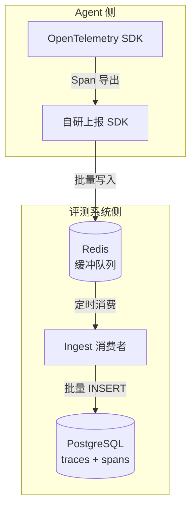
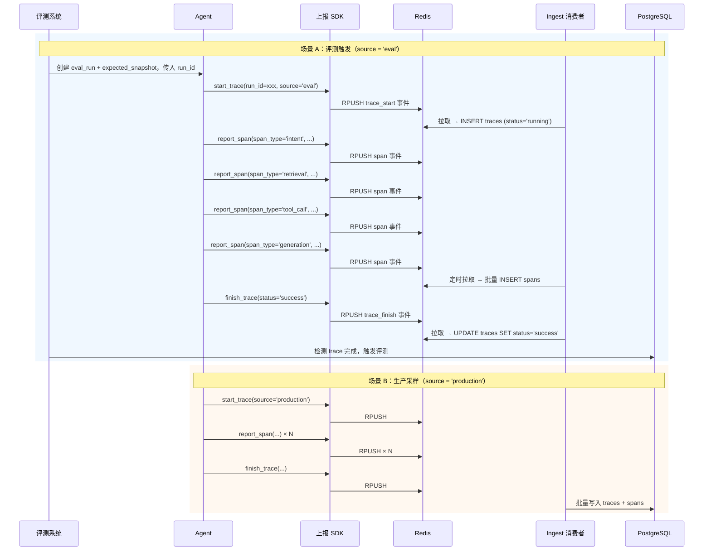
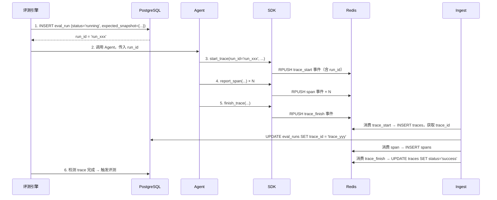
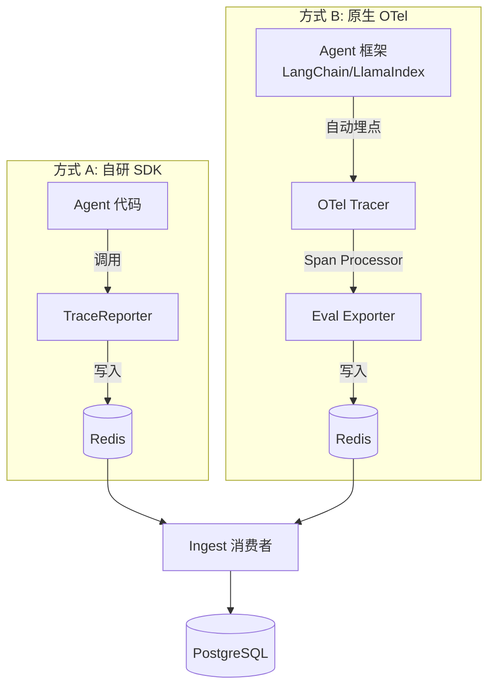
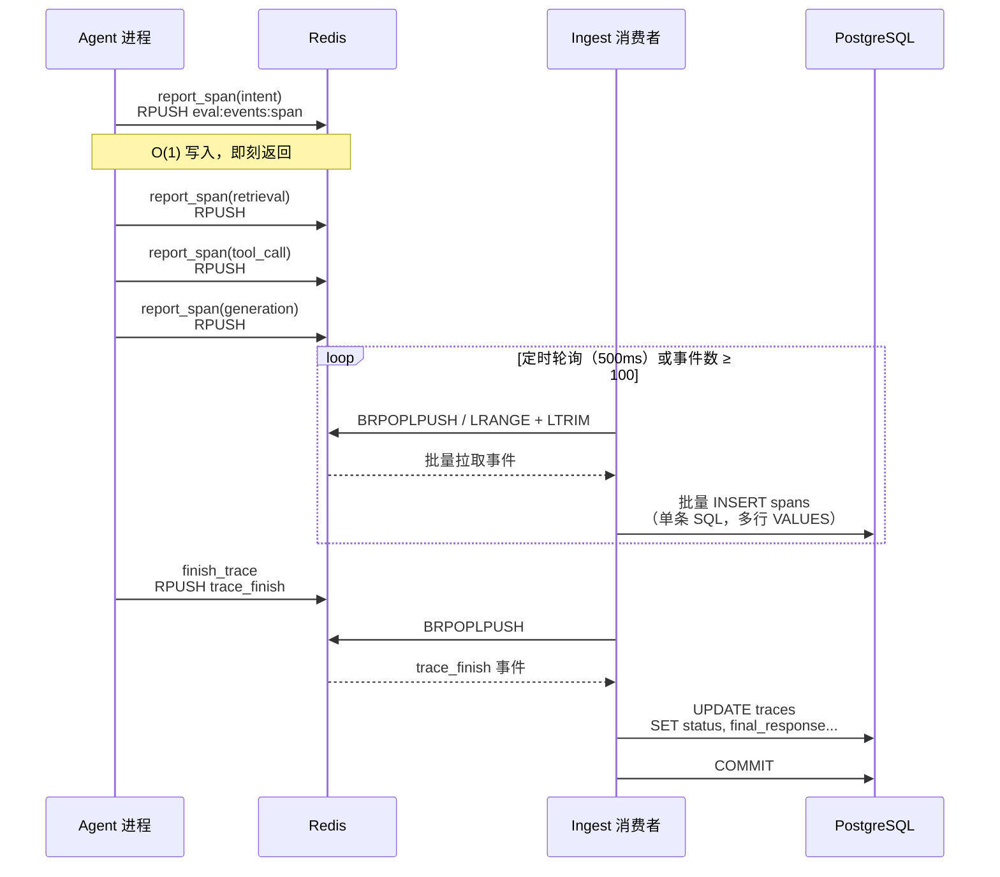
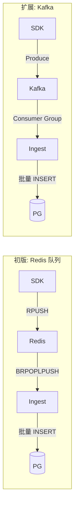

# 数据上报协议

> 定义被测 Agent 与评测系统之间的数据上报接口、SDK API、落表策略及 OpenTelemetry 集成方案。

---

## 1. 上报架构



- SDK 将 Span 事件写入 Redis List，进程崩溃数据不丢
- Ingest 消费者定时从 Redis 拉取，批量写入 PostgreSQL
- 后续可替换 Redis 为 Kafka，接口不变

---

## 2. 上报两种场景



---

## 3. SDK API

### 3.1 初始化

```python
from agent_eval_sdk import TraceReporter

reporter = TraceReporter(
    agent_version="v2.3.1",           # 必填，对应 traces.agent_version

    # Redis 配置（默认值）
    redis_url="redis://localhost:6379/0",
    redis_key_prefix="eval:events:",   # Redis Key 前缀

    flush_interval_ms=500,            # 刷新间隔，见第 7 节
    flush_batch_size=100,             # 单次拉取条数上限
)
```

### 3.2 Trace 生命周期

```python
# 开始一次 Trace
trace = reporter.start_trace(
    query="帮我查一下上周五NBA湖人队的比赛结果",
    context={"user_id": "u123"},
    source="eval",                     # 'eval' | 'production'
    run_id="run_xxx",                  # 评测场景传入，绑定 eval_runs
    source_ref=None,                   # 生产环境引用
)

# 逐阶段上报 Span（即刻写入 Redis，不阻塞 Agent）
trace.report_span(
    span_type="intent",
    input={"query": "..."},
    output={"intents": ["sports_query"], "confidence": 0.95},
    latency_ms=120,
    tokens={"input": 50, "output": 15},
    model="intent-classifier-v3",
)

trace.report_span(
    span_type="retrieval",
    input={"query_rewrites": [...]},
    output={"results": [...]},
    latency_ms=350,
)

trace.report_span(
    span_type="tool_call",
    input={"params": {"query": "NBA Lakers"}},
    output={"result": {...}},
    tool_name="web_search",
    tool_params={"query": "NBA Lakers"},
    tool_result={"status": "success", "data": "..."},
    latency_ms=1800,
)

trace.report_span(
    span_type="generation",
    input={"prompt": {...}},
    output={"response": "湖人队以112:105战胜..."},
    tokens={"input": 1200, "output": 350},
    model="gpt-4o",
    latency_ms=2800,
)

# 结束 Trace
trace.finish(
    final_response="湖人队以112:105战胜凯尔特人...",
    status="success",
)
```

### 3.3 异常场景

```python
trace.finish(status="error")
trace.finish(status="timeout")
```

---

## 4. 落表映射

### 4.1 start_trace → traces 表

| SDK 参数 | traces 列 | 说明 |
|---------|----------|------|
| 自动生成 | `id` | UUID |
| `agent_version` | `agent_version` | 初始化时配置 |
| `query` | `query` | 用户输入 |
| `context` | `context` | JSONB，用户上下文 |
| `source` | `source` | eval / production |
| `run_id` | —（通过 eval_runs 关联） | Ingest 消费时回写 eval_runs.trace_id |
| `source_ref` | `source_ref` | 生产环境引用 |
| — | `status` | 初始值 'running' |
| — | `overall_score` | NULL，评测后回填 |
| — | `total_latency_ms` | NULL，finish 时汇总 |
| — | `total_tokens` | NULL，finish 时汇总 |
| — | `total_cost_usd` | NULL，finish 时计算 |

### 4.2 report_span → spans 表

| SDK 参数 | spans 列 | 说明 |
|---------|---------|------|
| 自动生成 | `id` | UUID |
| `trace.id` | `trace_id` | 外键 |
| `span_type` | `span_type` | intent/retrieval/tool_call/generation |
| 自动递增 | `sequence` | 同一 trace 内自增 |
| `input` | `input` | JSONB |
| `output` | `output` | JSONB |
| `tool_name` | `tool_name` | 仅 tool_call |
| `tool_params` | `tool_params` | 仅 tool_call |
| `tool_result` | `tool_result` | 仅 tool_call |
| — | `tool_status` | 从 result 提取 |
| `latency_ms` | `latency_ms` | 毫秒 |
| `tokens` | `tokens` | JSONB |
| `model` | `model` | 模型名 |
| — | `score` | NULL，评测后回填 |

### 4.3 finish_trace → traces 表（UPDATE）

| SDK 参数 | traces 列 |
|---------|----------|
| `final_response` | `final_response` |
| `status` | `status` |
| 汇总自 spans | `total_latency_ms` |
| 汇总自 spans | `total_tokens` |
| 计算 | `total_cost_usd` |

---

## 5. 评测场景关联机制



---

## 6. OpenTelemetry 集成



### 6.1 OTel Span → spans 表映射

| OTel 属性 | spans 列 |
|-----------|---------|
| `Span.name` | `span_type`（如 `"intent"`, `"tool.web_search"`） |
| `Span.start_time / end_time` | `latency_ms` |
| `Span.attributes["input"]` | `input`（JSONB） |
| `Span.attributes["output"]` | `output`（JSONB） |
| `Span.attributes["tool_name"]` | `tool_name` |
| `Span.attributes["llm.model"]` | `model` |
| `Span.attributes["llm.usage"]` | `tokens`（JSONB） |

---

### 6.2 配置切换

项目中通过单一开关选择上报方式：

```python
# config.py
TRACE_MODE = "sdk"   # "sdk" | "otel"
REDIS_URL = "redis://localhost:6379/0"
AGENT_VERSION = "v2.3.1"
```

#### 方式 A：自研 SDK（TRACE_MODE = "sdk"）

```python
# 适合：无 OTel 集成的 Agent，或想手动控制 Span 粒度
from agent_eval_sdk import TraceReporter

reporter = TraceReporter(
    agent_version=AGENT_VERSION,
    redis_url=REDIS_URL,
)

# Agent 代码中显式调用 report_span
with reporter.start_trace(query="...", source="eval") as trace:
    # ... 意图识别 ...
    trace.report_span(span_type="intent", ...)
    # ... 召回 ...
    trace.report_span(span_type="retrieval", ...)
    # ... 工具调用 ...
    trace.report_span(span_type="tool_call", ...)
    # ... 生成 ...
    trace.report_span(span_type="generation", ...)
```

#### 方式 B：原生 OTel（TRACE_MODE = "otel"）

```python
# 适合：LangChain / LlamaIndex 等已自动埋点的 Agent 框架
# 无需 import agent_eval_sdk，只注册 Exporter

from opentelemetry.sdk.trace import TracerProvider
from opentelemetry.sdk.trace.export import BatchSpanProcessor

# 注册 Eval Exporter（将 OTel Span 写入 Redis）
provider = TracerProvider()
provider.add_span_processor(
    BatchSpanProcessor(EvalSpanExporter(redis_url=REDIS_URL))
)

# Agent 框架正常执行，自动埋点，无需手动 report_span
# LangChain 的 chain.invoke() 会自动产生 intent/retrieval/tool/generation 对应的 Span
```

#### 切换对比

| 维度 | 方式 A（自研 SDK） | 方式 B（原生 OTel） |
|------|-------------------|---------------------|
| 侵入性 | Agent 代码需显式调用 `report_span` | 零侵入，框架自动埋点 |
| Span 粒度 | 手动控制，精确到业务阶段 | 依赖框架埋点粒度 |
| 依赖 | 仅 `agent_eval_sdk` | `opentelemetry-sdk` + EvalExporter |
| 适用 | 自研 Agent、需要自定义 Span 结构 | LangChain / LlamaIndex 等标准框架 |
| Redis Key | `eval:events:span` | 相同，Ingest 无差别消费 |

两种方式写入 Redis 的数据结构完全一致，Ingest 消费者无感知。


## 7. Redis 缓冲与消费策略



**为什么用 Redis 而不是内存缓冲**：

| 方案 | 进程崩溃 | 数据量 | 扩展性 |
|------|---------|--------|--------|
| 内存 RingBuffer | ❌ 数据全丢 | 受进程内存限制 | 单机 |
| Redis List | ✅ AOF/RDB 持久化 | TB 级 | 多 Agent 共享队列 |

**关键参数**：

| 参数 | 默认值 | 作用 |
|------|--------|------|
| `flush_interval_ms` | 500 | Ingest 定时轮询间隔。低频时保证数据不滞留超过 500ms |
| `flush_batch_size` | 100 | 单次拉取条数上限。高频时批量消费，减少 DB 往返 |
| `redis_key_prefix` | `eval:events:` | Key 前缀。`{prefix}span` 存 Span 事件，`{prefix}trace` 存 Trace 生命周期事件 |

**两个参数是或关系，先到先触发**：

- 高频场景：500ms 内事件堆积超过 100 条 → `flush_batch_size` 先触发，拉取一批写入 DB
- 低频场景：事件数始终不到 100 → `flush_interval_ms` 先触发（500ms 到），保证最多 500ms 延迟

Ingest 使用 `LRANGE + LTRIM` 原子操作，消费的同时从队列移除。Redis 单线程模型保证消费期间新 `RPUSH` 进来的事件追加到队列尾部，不会被误删或遗漏。

---

## 8. 后续扩展：Redis → Kafka



切换方式：修改 `TraceReporter` 初始化参数，SDK API 不变。

```python
# 初版
reporter = TraceReporter(channel="redis", redis_url="...")

# 扩展
reporter = TraceReporter(channel="kafka", kafka_config={...})
```
